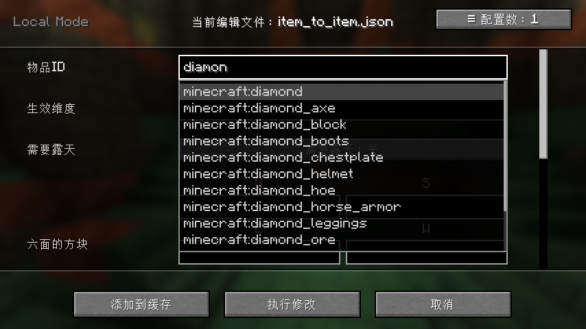
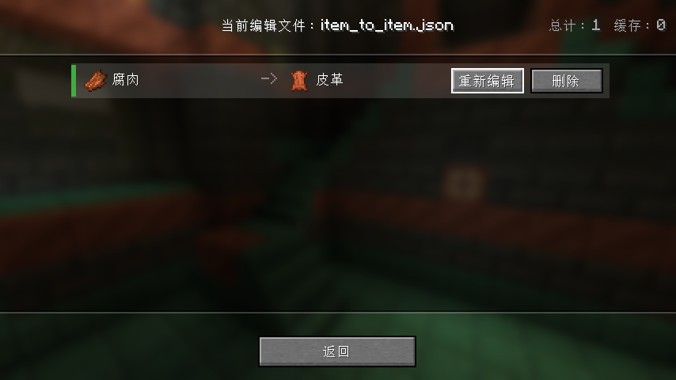

# 更新日志 Change log

## [开发中]
### 新增
- **NeoForge TOML 服务端配置**：新增 `ModConfigValues`，通过 `itemdespawntowhat-server.toml` 可调整以下参数：
  - `side_effects.lightning_interval_ticks`（默认 8）：闪电每次之间的间隔 tick 数
  - `side_effects.explosion_interval_ticks`（默认 5）：爆炸每次之间的间隔 tick 数
  - `side_effects.arrow_interval_ticks`（默认 2）：箭矢每支之间的间隔 tick 数
  - `block_placement.block_place_interval_ticks`（默认 1）：方块放置任务每圈之间的间隔 tick 数
  - `block_placement.block_place_circle_shape`（默认 `SQUARE`）：方块放置圆圈形状，`SQUARE`（正方形圈）或 `CIRCLE`（圆形圈）
- **`PlaceBlockTask` 重构**：不再持有原始物品实体引用，改用 callback 模式；支持可配置 tick 间隔与圆圈形状

### New Features
- **NeoForge TOML Server Config**: Added `ModConfigValues`, configurable via `itemdespawntowhat-server.toml`:
  - `side_effects.lightning_interval_ticks` (default 8): ticks between each lightning strike
  - `side_effects.explosion_interval_ticks` (default 5): ticks between each explosion
  - `side_effects.arrow_interval_ticks` (default 2): ticks between each arrow spawn
  - `block_placement.block_place_interval_ticks` (default 1): ticks between each ring of block placements
  - `block_placement.block_place_circle_shape` (default `SQUARE`): shape of placement rings, `SQUARE` or `CIRCLE`
- **`PlaceBlockTask` refactor**: no longer holds a reference to the original item entity; uses callback pattern; supports configurable tick interval and circle shape

## [1.0.4] 
### 新增 New Features
- 新增了可视化编辑配置文件的GUI，可以在游戏开始页面右上角找到入口
- 在单人模式下，可以使用**insert**键打开编辑GUI，多人模式下只有op玩家可以使用指令 `/editConversionConfigs`
打开GUI进行编辑（此功能测试中，有bug还请反馈）
- 游戏内使用GUI编辑后，使用指令 `/reloadConversionConfigs` 重新加载新规则

- Added a GUI for visually editing configuration files. You can find the entry point in the top-right corner of the game’s main menu.
- In single-player mode, the editor GUI can be opened using the **Insert** key. In multiplayer mode, only OP players can open the editor GUI using the `/editConversionConfigs` command.  
  (This feature is still under testing; please report any bugs you encounter.)
- After editing configurations in-game via the GUI, use the `/reloadConversionConfigs` command to reload the new rules.

### 下一步计划 Next Plans
- 添加GUI内文本框输入预览功能
- itemId 条目支持列表输入

- Add input preview functionality for text fields within the GUI.
- Support list-based input for `itemId` entries.

## [1.1.0]
### 新增 
- **优化 GUI**：改善了上一版本较为简陋的图形界面。在注册名 (物品、方块、实体ID)输入框中输入内容时，将自动显示建议下拉列表，方便快速选择。

- **配置管理 GUI**：现在可以在图形界面内直接**新增、删除或编辑配置**，无需手动修改配置文件，对新手更加友好。

- **支持六面方块标签 (Block Tags)**：所有六面方块现在可以使用标签。
- **新增“物品对应方块 (Item Corresponding Block)”选项**：
  - 在 `item_to_block.json` 配置中启用后，当源物品为方块物品时，将自动使用其对应方块。
  - 无需手动填写目标方块的注册名，提高使用便捷性。
- **命令更新**：
  - `/conversion_config reload`：重新加载所有配置文件。
  - `/conversion_config edit`：打开配置编辑 GUI。

### New Features

- **Improved GUI**: The previously simplistic graphical interface has been enhanced. When entering text in the "Registry Name" input field, a suggestion dropdown will now appear for quick selection.
- **Existing Configuration Management GUI**: Configurations can now be **created, deleted, and edited directly in the GUI**, eliminating the need to manually edit configuration files.
- **Support for Six-Sided Block Tags**: All six-faced blocks now support block tags.
- **New `block_of_item` Option**:
  - When enabled in `item_to_block.json`, if the source item is a block item, its corresponding block will be automatically used.
  - No need to manually enter the target block's registry name, improving usability.
- **Command Updates**:
  - `/conversion_config reload` – Reload all configuration files.
  - `/conversion_config edit` – Open the configuration editor GUI.

## [1.1.1]

### 新增
- 新增 **辅助物品（Catalyst Item）** 与 **浸润流体（Inner Fluid）** 两个配置字段，现在可以实现更多带条件的世界转化。
- 为 GUI 中的多个字段增加了自动补全功能，现在 **维度（Dimension）** 与 **标签（Tag）** 也支持自动补全。
- 将游戏内打开 GUI 的快捷键默认设置为 **未绑定**。由于该功能在游戏中使用频率较低，此调整可以避免误触或按键冲突。您仍然可以通过指令 `/conversion_config edit` 打开配置编辑 GUI。
- 优化了整体性能。

> 注意：维度和标签支持通过数据包进行扩展。在服务端启动之前，系统无法获取完整的数据用于自动补全。如果您需要使用完整的补全功能，请在进入世界后再进行编辑。编辑完成后，请不要忘记使用 `/conversion_config reload` 重新加载规则，否则新配置不会生效。

### 修复
- 修复了在多个维度同时进行转化时无法正常执行的 Bug。
- 修复数字文本框无法输入负数的 Bug。
- 修复实体上限不正确的 Bug

### Added
- Added two new configuration fields: **Catalyst Item** and **Inner Fluid**, enabling conditional world conversions.
- Added auto-completion for more fields in the GUI. **Dimensions** and **Tags** are now also supported in the auto-complete system.
- The in-game keybinding for opening the GUI is now **unbound by default**. Since this feature is rarely used during gameplay, this change helps prevent accidental triggers or key conflicts. You can still open the configuration editor GUI using the command `/conversion_config edit`.
- Improved overall performance.

> Note: Dimensions and tags can be extended via **datapacks**. Before the server starts, the game cannot retrieve the full set of data required for auto-completion. If you want to use the complete auto-completion feature, please edit the configuration after entering a world. After editing, remember to run `/conversion_config reload` to apply the new rules.

### Fixed
- Fixed the bug where conversions failed to run correctly when multiple dimensions were being processed simultaneously.
- Fixed the bug where negative numbers couldn't be entered in the numeric text box.
- Fixed the bug where the entity upper limit was incorrect.

## [1.1.2]
### 计划
- 修改转化实体配置类，为实体添加分支（）
- 添加转化为事件：箭雨、爆炸、闪电、天气调整
- 删除游戏主页面的按钮入口，因为标签、维度等支持数据包的条目需要服务端启动才能获取完整信息
- 为GUI提供了更多错误信息显示，为编辑选择按钮添加了tooltip
- itemId支持标签，催化剂物品支持标签