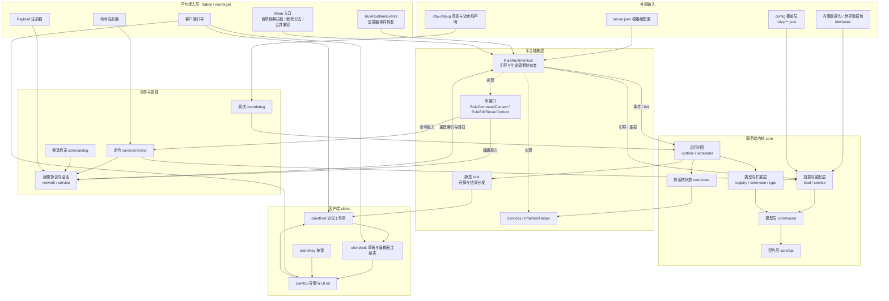

# 架构总览

> 本文只描述分层、依赖方向与数据流，不展开类与方法。
> 各层职责细节见 [layers/](layers/)；端到端链路见 [flows.md](flows.md)；硬约束见 [conventions.md](conventions.md)。

## 1. 分层模型

系统按"平台接入 → 平台抽象 → 服务端内核 → 创作与管控 → 客户端"组织，共五组、十层：

| 组 | 层 | 位置 | 职责 |
|---|---|---|---|
| 外部输入 | 资源与配置 | 数据包、`config` | 提供规则文件、模组级配置、开发环境场景声明 |
| 平台接入 | 加载器接入层 | `fabric/`、`neoforge/` | 把加载器事件、网络载荷、命令、客户端引导接到内核；承载最小 Mixin |
| 平台抽象 | 平台抽象层 | `platform/`、`core/config` | 平台能力契约、窄接口、静态 sink、引导与生命周期持有者 |
| 服务端内核 | 契约层 | `core/api` | 全局对外契约：类型、执行 / 求值上下文、解码、问题模型、字段常量 |
| 服务端内核 | 模型层 | `core/model` | 规则数据形态、条件树、编解码组装、语义校验 |
| 服务端内核 | 类型与扩展层 | `core/registry`、`core/extension`、`core/type` | 类型注册表、第三方 SPI、内置条件与效果实现 |
| 服务端内核 | 加载与装配层 | `core/load`、`core/service`（装配） | 三层来源读取、合并、解码、校验、候选索引 |
| 服务端内核 | 运行时层 | `core/runtime`（含 `scheduler`）、`core/state` | 追踪、排期、求值、完整组结算与返还、共享预算调度、实体状态 |
| 创作与管控 | 目录与编辑层 | `core/catalog`、`core/network`、`core/service`（编辑） | 候选枚举、编辑快照、变更集、独占会话、权威落盘 |
| 创作与管控 | 命令与调试层 | `core/command`、`core/debug` | 命令树与权限口径；开发环境场景、流水线、性能观测 |
| 客户端 | 客户端层 | `client/net`、`client/edit`、`client/ui`、`client/key` | 协议工作区、草稿与撤销、编辑器注册表、界面与 UI kit、按键 |

## 2. 架构关系图

图读法：实线表示调用 / 数据方向，虚线表示"平台侧实现 core 定义的窄接口"。
内核不向上引用平台与客户端；客户端只经协议与静态 sink 与内核通信。

## 3. 依赖方向铁律

1. **平台隔离**：`common/` 不引用任何加载器 API；平台专属代码只存在于 `fabric/` 与 `neoforge/`。
2. **端隔离**：服务端路径不引用客户端类型；内核通过静态 sink 与窄接口与界面解耦，客户端未安装 sink 时服务端行为为空操作。
3. **依赖倒置**：内核不反向依赖平台运行时；平台能力以窄接口、静态 sink、注入点三种方式进入内核。
4. **模型单向**：契约层是全项目依赖底座；模型层依赖契约层；加载层不依赖模型层（经解码契约注入模型）。
5. **客户端单向**：客户端可以依赖内核公开类型，内核不得依赖客户端；UI kit 是可被宿主依赖的独立边界，不反向依赖宿主与业务包。

## 4. 三条数据流

### 4.1 规则流（配置 → 可执行索引）

三层来源 → 读取与合并 → 解码 → 结构 / 参数 / 动态引用校验 → 构建候选索引（含门槛运行投影）→ 运行时按源物品查询候选。
规则流在**服务端启动、数据包重载、命令重载、编辑器保存**四条路径上共用同一实现；失败时保留上一版索引继续服务。

### 4.2 掉落物流（实体 → 结算 → 产物）

掉落物入世界 → 排除与候选判定 → 建立追踪并排期 → 到期检查与条件求值 →（命中）整堆源转入结算库存
→ 计划组数与候选 → 按组支付固定成本并派发效果 → 剩余源作为返还物交还世界 → 记录与清理。
中断（重载 / 维度卸载 / 停服）只保留"待返还"这一部分状态，重启后仅交付返还，不重放已开始的效果。

### 4.3 编辑流（界面 → 权威落盘 → 生效）

命令取独占编辑锁 → 客户端确认并请求快照 → 服务端下发来源三视图与问题清单 → 客户端在本地草稿上编辑（含撤销）
→ 提交变更集 → 服务端校验（解码 / 语义 / 动态引用）→ 基于磁盘内容原子写覆盖层 → 重建索引并回扫 → 回执并推进版本戳。

## 5. 关键结构性特征

- **单条命中**：同一掉落物在一次到期检查中只执行优先级最高的一条命中规则。
- **完整组结算**：命中后按"完整组"推进，成本按组支付，数量守恒，执行失败不回滚、不免费重试。
- **共享预算**：所有维度共享一份每 tick 软预算与工作量上限，任务按"维度 × 任务种类"公平轮转；长操作必须拆成有界步骤。
- **整体重建优于单点失效**：规则重载时索引与依赖数据包的缓存整体丢弃重建，不提供局部失效路径。
- **声明与派生分离**：运行期派生值（如留空门槛的有效数量）在索引构建时投影得出，不写回用户声明。
