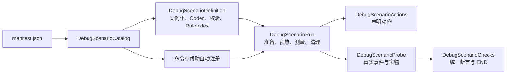

# Debug 场景统一路线与扩展

全部23个场景（18个功能、5个性能）共用声明、规则解析、执行、观测及断言线路。资源位于 `common/src/main/resources/idtw-debug/scenarios/`，不参与内置数据包加载。



功能和性能是同一执行器的两种观测模式。功能场景允许小规模夹具、动作和逐实体日志；性能场景只做汇总计数、固定密度布置和窗口采样，不扫描返还物，也不创建逐实体 JSON。

## 新增普通场景

1. 复制 [run/convert.json](../../common/src/main/resources/idtw-debug/scenarios/run/convert.json) 为 `run/<名称>.json`，修改规则 ID、输入和预期。名称只用小写字母、数字和下划线。
2. 将 `run/<名称>` 加入 `manifest.json`。名称、默认参数及帮助条目自动注册，无需修改 Java 列表。
3. 在 en_us.json、zh_cn.json 增加 `itemdespawntowhat.command.debug.scene.description.run.<名称>`。
4. 重启开发环境，运行 `/idtw debug examples` 和 `/idtw debug run <名称>`。

资源契约版本为 `schema_version=1`。`inputs` 包含源实体数、每堆数量、催化剂数量、源与催化剂物品 ID；`seconds` 是默认测量时长；`setup`、`actions` 是准备与动作；`expected` 是断言；`rules` 使用正式规则 JSON 格式。

输入范围：功能源1～16，性能源0～1000；每堆1～64；催化剂0～64；时长10～300秒。目录检查路径、重复登记、版本、未知元数据字段、输入范围和动作类型；规则经真实 Codec 与 RuleValidation 校验。源物品不限于纸张。

## 参数和动作

JSON 字符串值支持固定数值变量，实例化后变成 JSON 数字：

| 变量 | 值 |
| --- | --- |
| `$sources` | 本轮源实体数，性能指令可覆盖 |
| `$source_items` | 源实体数 × 每堆数量 |
| `$origin_y_plus_3` | 本轮起点 Y + 3，用于 retry 高度条件 |

不执行脚本或算术表达式。每轮生成独立副本，不修改目录模板。

`setup` 支持 `none`、`expiry`、`excluded`。expiry 使用真实平台寿命准备年龄；excluded 要求2个源，分别授予检查锁和无限寿命。

`actions` 为动作列表，每个动作最多执行一次，同时满足世界刻与真实事件门槛才执行：

```json
{"type":"move_source","after_ticks":100,"after_event":"RETRY","offset_y":3}
{"type":"reload","after_ticks":0,"after_event":"EFFECT_SCHEDULED","offset_y":0}
```

`after_ticks` 从本轮创建开始计数；`after_event` 为空串时不等待事件。动作按声明顺序检查，未满足门槛的动作不会阻塞后续动作。最多16个动作，after_ticks 为0～6000，offset_y 为-64～64。

新增动作只扩展 `DebugScenarioSpec.ActionType` 和 `DebugScenarioActions` 的类型分派，无需在运行器、命令或断言中添加场景名判断。新增准备方式同理扩展 Setup 和准备入口。

## 统一断言

所有场景，包括性能基线，均输出 `END.expected`、`END.actual` 和逐项 `END.checks`。失败项另记 `CHECK_FAILED`；校验定义错误记 `EVALUATION_ERROR`、标记 INCOMPLETE，并继续清理。

`expected.metrics` 支持精确值、min/max 数值范围和 `@指标名` 的实际指标引用：

```json
{
  "conversions": "$sources",
  "remaining_source_items": 0,
  "first_output_delay_ticks": {"min": 100},
  "first_conversion_age": {"min": "@minimum_due_age_ticks"},
  "events/RETRY": {"min": 1}
}
```

可用指标：

- 运行：conversions、remaining_source_items、output_items、live_output_items、first_conversion_age、minimum_due_age_ticks、expiry_due_age、first_rule、first_output_delay_ticks、action_count。
- 结算：groups、consumed_sources、returned、pending_delivery、settlements_completed、chance_skipped。
- 实物：live_returned_source_items、protected_returned_source_items、remaining_catalyst。
- 事件：`events/<事件名>` 表示真实事件次数。
- 功能产物延迟：`first_output_delay/<物品ID>`；例如金粒至少40 tick。相对于本轮首次提交，仅适合来源一致的小规模场景。

`expected.outputs` 按物品 ID 声明件数；同时检查实际生成累计量和最终留存量，未声明产物按零预期校对。可选的 `expected.candidates` 声明各候选被选择的次数，区别于一个候选执行的组数。

框架始终检查准备数量、测量窗口、运行错误、重复或提前提交、效果失败及未完成效果任务。pending_scene_effects仅统计非CONDITION_CHECK的场景句柄；pending_scene_checks单列正常条件检查，允许retry负载继续等待。全部句柄仍在清理时精确取消。每份资源必须声明提交次数、剩余源与产出。pending_units 保留为结算完成事件当时的账目快照，延迟效果可能尚未执行，不自动作为最终产出断言。

## 性能及生命周期边界

性能场景放入 `bench/<名称>.json` 并登记同一 manifest，描述键对应 `description.bench.<名称>`。非空负载接受 `[实体数] [秒数]`，默认0实体的空基线只接受 `[秒数]`；功能场景接受 `[秒数]`。

性能声明使用 setup=none、无动作、无催化剂夹具，不扫描实物返还。返还机制使用功能场景验证；性能场景可检查结算返还账目，应期待完整消费且返还为0。

发布环境不读取目录，debug 命令和场景查找再次检查开发标志。测试源绑定独立规则索引，其他夹具绑定空索引，所有夹具共用装饰和清理路径。

reload 是真实全局重载，会取消运行时队列，影响普通实体的排队任务，请使用独立测试存档。后端结算与恢复任务仍沿用已有独立生命周期；提前 stop 不保证清空待返还账本。本次统一没有修改后端结算契约。

## 新增自动阶段

阶段资源在 `common/src/main/resources/idtw-debug/pipelines/`，由独立 manifest 驱动 `DebugPipelineCatalog`、`DebugPipelineCommands` 和 `DebugPipelineManager`。调度器复用上述场景执行器，END/清理/解绑回调后开始冷却，无需新增mcfunction或平台事件。

1. 复制阶段 JSON，登记到该目录的 `manifest.json`；名称为小写字母、数字、下划线，不能用 help/status/stop。
2. 在两份 lang 增加 `itemdespawntowhat.command.debug.pipeline.description.<阶段名>`。
3. 重启开发环境，执行 `/idtw debug pipeline` 查看新增条目。

```json
{
  "schema_version": 1,
  "quantity": "fixed",
  "default_entities": 100,
  "rounds": 1,
  "performance_gate": true,
  "steps": [
    {"scenario": "bench/baseline", "entities": 0, "seconds": 20},
    {"scenario": "bench/retry", "entities": "$entities", "seconds": 20}
  ]
}
```

`quantity=none`：不接受数量参数，default_entities=0；`fixed`：接受1～1000数量，性能步骤可用 "$entities"；`ceiling`：接受100～1000上限，仅执行entities不超过上限的预设步骤，不使用变量。功能步骤数量必须等于场景声明的源数量。

rounds 为1～3，对整个steps列表重复；展开后最多64步。seconds 为10～300秒，默认冷却5秒，命令可改为3～30秒。performance_gate=true额外检查TPS、tick p95、完整窗口、样本截断、索引变化及计时完整性，失败即停止。它不修改单场景的功能PASS定义。v3按同tick原版成本与IDTW运行时成本相加后统计tick分位数，不直接相加两种p95。

按阶段执行与压力门槛见 [实机测试流水线](debug-test-pipeline.md)，场景操作见 [结算示例](debug-settlement-examples.md) 和 [基础及性能验证](debug-validation-guide.md)。
