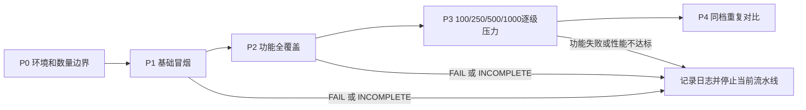

# 开发环境实机测试流水线

这是开发环境中的串行测试流水线。每个阶段可用一条 `/idtw debug pipeline` 命令启动；复用统一场景执行器，等待上一轮真正 END、清理和解绑后再冷却，随后启动下一轮。本机压力测试最高1000个源实体，不再使用10000档。

## 一键运行

启动 Fabric Client 或 NeoForge Client，进入开启作弊的独立测试存档；站在已加载空旷区域，等待世界稳定约30秒，保持20 tick rate。控制台过滤 `[IDTW_DEBUG]`。

| 命令 | 自动执行内容 | 默认间隔下的大致耗时 |
| --- | --- | --- |
| `/idtw debug pipeline p0` | 测20秒空基线；`bench normal 1001 10` 的数量拒绝边界是**只解析不执行**的检查，每个阶段启动时都会执行 | 约26秒 |
| `/idtw debug pipeline p1` | 基础4个功能场景，各12秒 | 约1分15秒 |
| `/idtw debug pipeline p2` | 其余14个功能场景，各12秒，reload最后 | 约4分15秒 |
| `/idtw debug pipeline p3` | 空基线，再逐级100/250/500/1000档的4类负载，各20秒，最多17轮 | 约7～8分钟 |
| `/idtw debug pipeline p4 500` | 固定500实体；基线、normal、converted、retry各60秒，整组重复3次 | 约13分钟 |

阶段独立启动：日常回归按 P0→P1→P2；全部通过后再运行 P3；P4 的实体数由你根据 P3 的稳定档位指定，最大1000，省略时保守使用100。

- P0/P1/P2 参数为 `[间隔秒]`，例如 `/idtw debug pipeline p1 8`。
- P3 参数为 `[最高实体数] [间隔秒]`，例如 `/idtw debug pipeline p3 500 8` 只测试100、250、500三档，不进入1000。最高数量允许100～1000，只选择不超过该数的预设档位。
- P4 参数为 `[实体数] [间隔秒]`，例如 `/idtw debug pipeline p4 500 8`。
- 间隔默认5秒，允许3～30秒；从清理完成开始，墙钟与世界时间均满足间隔才继续。低TPS时实际等待可能更长。最后一轮也冷却并检查残留，再给出阶段结论。
- `/idtw debug pipeline status` 查询进度及冷却；`/idtw debug pipeline stop` 中止整阶段。原 `/idtw debug status`、`/idtw debug stop` 同样适用于阶段。
- 只允许一个活动阶段或场景，冷却时也拒绝插队。阶段起点固定，玩家须留在原维度和测试区域；离线、切换维度、改变tick rate会中止阶段。性能场景会固定视角，勿暂停世界。
- 场景 FAIL/INCOMPLETE、清理异常或性能门槛失败会停止后续步骤，已完成结果仍保留。下一阶段由你决定是否启动。

P0/P3/P4 自动检查 TPS≥19.5、tick p95≤50000µs、测量完整、无样本截断、索引未变化及计时无缺失；功能 PASS 与性能判定分别记录。P1/P2 以功能断言为准。tick p95按同tick的原版成本＋IDTW运行时成本统计，分项分别在vanilla_tick_cost和idtw_runtime_cost中，后续开发场景推进与其它结束事件监听器不计入该范围。CPU占用、客户端FPS、视觉异常和队列延迟趋势仍需人工观察。

控制台事件 `PIPELINE_START → PIPELINE_STEP_START → 场景START/END → PIPELINE_STEP_END → PIPELINE_COOLDOWN → … → PIPELINE_END` 带阶段UUID及各场景run编号。阶段汇总的 `results` 包含轮次、数量、功能结论、性能门槛和TPS/p95。不要将不同平台或不同配置的数据混在一起比较。

阶段计划位于 `common/src/main/resources/idtw-debug/pipelines/`，与场景一样是开发专用类路径资源，不属于 builtin datapack，也不需要启用数据包。发布环境不注册命令或读取计划。扩展方式见 [统一技术路线](debug-scenario-extension.md)。

下面保留各阶段的验收内容与单场景命令，便于定位失败。使用一键阶段命令时无需再逐条执行这些命令；手动复测则必须等上一轮 END、清理与至少5秒间隔后再执行下一条。

数量参数指本轮准备的源实体数，产物和世界背景实体另外计数，不是整个世界的实体总数上限。当前压力场景每个源只有1件物品，转化负载最终每源产出1个海晶碎片。



## P0：环境和数量边界

1. IDEA 检查工作区 Java 错误/警告后，通过 `powershell -ExecutionPolicy Bypass -File tools/dsh-build.ps1 -Tasks "build"` 构建。
2. 启动 Fabric Client 或 NeoForge Client，进入独立测试存档，开启作弊。两平台分别验收，日志不要混在一起比较。
3. 固定 JDK/JVM 参数、堆大小、渲染与模拟距离、模组列表及测试坐标。保持默认20 TPS，不暂停世界；进入世界后等待约30秒稳定。
4. 选择至少12×12格的已加载空旷区域，清空附近普通掉落物，尤其绿宝石。1000源、0.25格间距的网格约8×8格。整轮留在区域内，性能阶段保持玩家视角和位置静止。
5. 执行 `/idtw debug examples` 核对场景列表。IDEA 控制台过滤 `[IDTW_DEBUG]`，按 run 编号保存每轮 START～END。
6. 在没有活动场景时运行 `/idtw debug bench normal 1001 10`：命令必须拒绝数量，不能出现该命令对应的 START 或创建实体。随后正常命令的 START 应显示 `source_entity_limit=1000`，且 entities 不超过1000。

1001是边界拒绝测试，不会实际生成1001个实体。不要修改 JSON 绕过数量限制；命令、资源加载和运行前检查共用同一上限。`/idtw debug pipeline` 的每个阶段在启动时也会自动做一次同样的解析检查（只解析、不执行）。

## P1：基础冒烟

按顺序逐条执行，每轮默认12秒测量，加约1秒世界预热：

```mcfunction
/idtw debug run convert
/idtw debug run stack
/idtw debug run delay
/idtw debug run expiry
```

| 场景 | 核心预期 |
| --- | --- |
| convert | 1次提交，1个海晶碎片 |
| stack | 1次提交，16组，16个海晶碎片 |
| delay | 1个海晶碎片，提交至首次产出至少100 tick |
| expiry | 自然消失入口被延后并触发转化，1个海晶碎片 |

每轮必须 END.verdict=PASS、所有 checks.pass=true、remaining_scene_tasks=0，且结束后没有继续出现本轮产物。任一失败即保存 CHECK_FAILED/ERROR/EVALUATION_ERROR 和整轮日志，先修复或确认测试环境再进入 P2。

## P2：功能全覆盖

P1 已覆盖4个基础场景，下面补齐其余14个，合计覆盖当前18个功能场景：

```mcfunction
/idtw debug run retry
/idtw debug run priority
/idtw debug run excluded
/idtw debug run source_cost
/idtw debug run rebate
/idtw debug run insufficient
/idtw debug run outcome_priority
/idtw debug run round_robin
/idtw debug run multi_effect
/idtw debug run chance_skip
/idtw debug run condition_tree
/idtw debug run catalyst
/idtw debug run catalyst_limited
/idtw debug run reload
```

| 分组 | 额外观察 |
| --- | --- |
| retry / priority / excluded | 条件先失败再成功；较早到期规则先转换；排除源不转换 |
| source_cost / rebate / insufficient | 分别执行4组、3组、0组；返还分别0、1、2件 |
| outcome_priority / round_robin | first优先；轮询的两种产物各2件，候选各选2次 |
| multi_effect / chance_skip / condition_tree | 金粒延迟至少40 tick；4次概率跳过且零产出；嵌套条件树通过 |
| catalyst / catalyst_limited | 分别执行4组、2组；绿宝石耗尽；不足场景返还2件源 |
| reload | 延迟效果入队后全局重载，取消事件1次、零产出、无剩余场景效果任务 |

返还场景同时核对实物数量与永久保护/禁转状态。reload 放在最后，避免它的真实全局队列取消扰动其它场景；仅在测试存档使用。

P1、P2 自动执行合计约5分30秒，已含默认5秒冷却，不含人工观察。可以执行 `/idtw debug mark <观察>` 记录肉眼结果，但性能阶段不使用 mark。

## P3：逐级压力探索

先运行空基线，确认背景世界本身能稳定推进：

```mcfunction
/idtw debug bench baseline 20
```

然后在 N=100、250、500、1000 四档依次执行以下四轮，N为数量占位符，需替换成实际数字：

```text
/idtw debug bench normal N 20
/idtw debug bench converted N 20
/idtw debug bench convert N 20
/idtw debug bench retry N 20
```

首次档位可直接复制下面的命令逐条执行：

```mcfunction
/idtw debug bench normal 100 20
/idtw debug bench converted 100 20
/idtw debug bench convert 100 20
/idtw debug bench retry 100 20
```

| 负载 | 功能预期 | 测量用途 |
| --- | --- | --- |
| normal | 0提交，N个源保留，无产物 | 原版掉落物实体成本对照 |
| converted | N次提交、N个海晶碎片，5游戏秒后到期 | 较早转化与产物开销 |
| convert | N次提交、N个海晶碎片，10游戏秒后到期 | 常规到期转化和集中结算 |
| retry | 0提交、N个源保留、真实条件失败与重试 | 持续检查和退避成本 |

每轮 END 后至少休息5秒，确认清理完毕和操作恢复流畅。只有当前档四轮都通过下面的功能和性能门槛，才提高到下一档；1000是硬上限，不代表本机必须达到这个档位。正常负载已经不达标时，优先降低实体数量或背景负载。

**功能门槛**：verdict=PASS、checks全通过、无 ERROR/EVALUATION_ERROR、remaining_scene_tasks=0。性能判定独立于场景 END.verdict；单场景 PASS 本身不检查 TPS，一键阶段额外用 performance_checks 判断是否继续。

**建议性能门槛（验收目标，尚未实测确认）**：

- window.observed_ticks_per_second ≥19.5。
- window.server_tick_cost.p95_us ≤50000（50ms，即20 TPS的单tick时间预算）。
- window.sample_limit_reached=false，sampled_seconds ≥请求时长，window.index_changes=0。
- window.tick_timing_complete=true，tick_timing_missing_ticks=0。当前日志format为idtw-scene-v3；旧v2的tick耗时只含原版成本，不能与新口径混比。
- FRAME 的就绪延迟没有连续多秒增长，结束后没有本轮遗留产物或持续卡顿。

最旧就绪延迟和队列深度应结合场景判断：retry 的检查队列会持续保留任务，不能要求测量结束前全部队列为0。清理后全局队列也可能含普通世界任务，不用全局 pending=0 作为通用断言。

卡顿明显时直接停止加量。必须提前退出当前轮时用 `/idtw debug stop`，结果记 INCOMPLETE；若结算中断后出现待返还残留，重建独立测试存档后再测，避免污染下一轮。

P3 最多17轮、每轮20秒，含预热和5秒轮间等待约7～8分钟。若低 TPS 导致转化窗口不足，可在较低档位用60秒确认机制；延长窗口不会消除 CPU 过载，不把它当作性能达标依据。

## P4：稳定档位重复对比

选择 P3 中四类负载均达标的最高档位 N（最大1000），固定该数量和全部配置。优化前、优化后或不同平台分别测量，不混用条件。

每个版本运行3组；每组依次执行：

```text
/idtw debug bench baseline 60
/idtw debug bench normal N 60
/idtw debug bench converted N 60
/idtw debug bench retry N 60
```

这部分约12分钟测量，加预热与轮间等待约13分钟；仅在需要正式性能结论时执行。每类负载报告3轮均值和范围，保留每轮日志，不只挑最快结果，不将两个p95直接相减当成纯模组分位数。

## 离线日志解析

实机运行后可执行 `python tools/analyze-debug-log.py`，默认解析NeoForge最新日志，导出阶段结果、场景TPS/tick指标、功能与性能失败项和队列信息。每次结果保存到Git忽略的 `.local/debug/reports/<时间>/`，包含report.md、report.json和scenes.csv，终端显示实际路径。

指定其它日志及独立输出目录：`python tools/analyze-debug-log.py fabric/runs/client/logs/latest.log --out .local/debug/reports/fabric-debug`。仅用Python标准库，也支持.gz轮转日志；显式指定同一输出目录时会覆盖旧结果。

开发分析记录放在 `.local/debug/analysis/`，日志快照放在 `.local/debug/logs/`，只保留本地。首次实测的历史分析和修复记录均位于该目录；仓库仅保留解析工具与通用测试说明。

## 记录和失败分流

每轮记录一行，原始 START～END 日志作为依据：

| 阶段 | 平台/构建标识 | 场景/数量/秒数 | run | verdict | TPS | tick p95 µs | checks/effects p95 µs | 性能达标 | 现象 |
| --- | --- | --- | --- | --- | --- | --- | --- | --- | --- |
| P3 | 待填写 | normal/100/20 | 待填写 | 待填写 | 待填写 | 待填写 | 待填写 | 待填写 | 待填写 |

- CHECK_FAILED：逐项核对 expected/actual，判断规则、数量、返还或动作行为错误。
- EVALUATION_ERROR：场景声明或观测指标有误，先修复定义，不能当作业务测试通过。
- 功能PASS但TPS/p95不达标：记录为性能失败，停在当前档，降低负载后再测。
- INCOMPLETE：记录停止原因；这轮不能替代完整测试数据。
- 普通对照 normal 也很慢：优先核对原版实体、背景世界与本机负载，不直接归因于转化代码。

后端账本/恢复任务仍沿用原有独立生命周期，提前停止可能留下待返还记录。流水线在启动及每次冷却结束检查已加载世界的测试标签/标记残留，发现后拒绝继续；不会加载区块，也无法证明隐藏账本或未带标记的迟到产物全部消失。提前停止或清理异常后应重建独立测试存档再测。当前流程不覆盖真实玩家死亡标签注入、跨区块卸载恢复、GUI编辑保存、数据包三层覆盖和第三方模组兼容；这些需要另行专项验收。

日常回归执行 P0～P2；探索本机压力上限追加 P3；准备性能对比结论时再执行 P4。详细场景预期见 [结算示例](debug-settlement-examples.md)，扩展声明见 [统一技术路线](debug-scenario-extension.md)。
