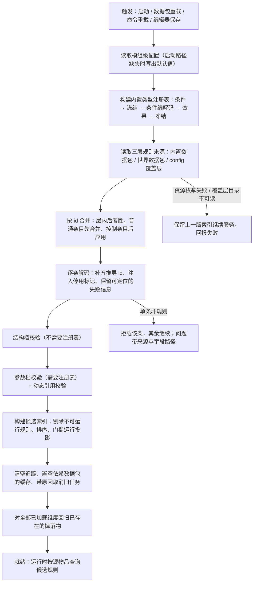
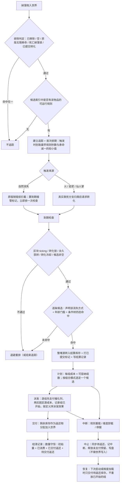
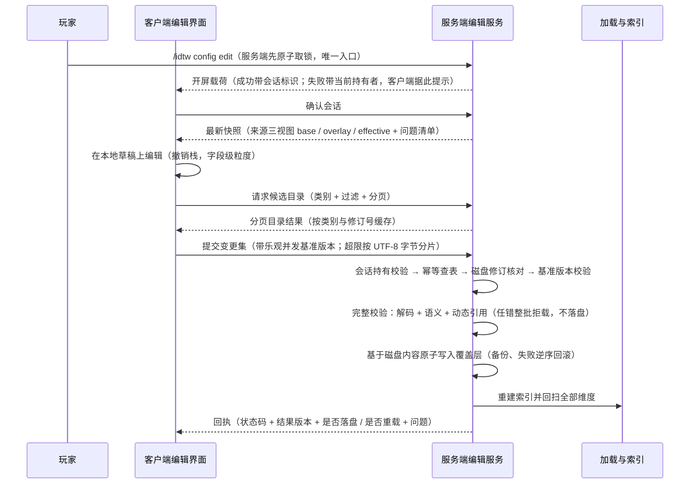
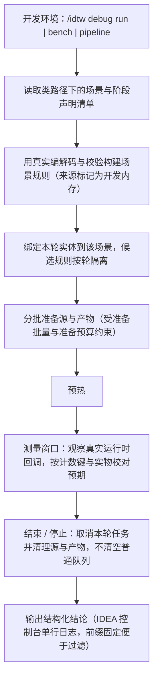

# 关键交互流程

> 四条端到端链路的抽象视图：规则怎么变成可执行索引、掉落物怎么被转化、规则怎么被安全写回、开发环境怎么验证真实链路。
> 涉及层次见 [architecture.md](architecture.md)；类级细节见 [backend/flows/](backend/flows/)。

## 1. 规则加载链路

**触发时机**：服务端启动、数据包重载、命令重载、编辑器保存后重建。四条路径共用同一实现。

**关键契约**：优先级为覆盖层 > 世界数据包 > 内置数据包；控制条目只在覆盖层合法；控制字段按取值判定；
规则标识在读取侧与写入侧的推导规则必须一致；校验必须使用"带注册表"的参数档，否则未注册类型与区间类非法参数会被静默放行。

**失败与边界**：单个坏文件只影响该条；枚举失败保留旧索引；重载不清空已提交的效果（只重建检查与索引）；
后加载的维度由维度加载事件补一次回扫；启动期的首次加载不按重载处理（此时维度尚未创建）。

## 2. 转化生命周期

**关键契约**：同一次检查只执行优先级最高的一条命中规则；年龄门槛只对非环境触发的自然消失生效；
环境致死请求在受伤调用栈内同步完成条件检查与规则选择；计划量不冒充成功量，真实完成量只来自执行器回执与进度上报；
概率落空、效果条件不满足、执行中途失败仍属已支付组。

**边界**：整堆源物品一次性转入结算库存，因此"被规则接管的掉落物"在结算期间不再以掉落物形式存在于世界；
目标区块未加载时不主动加载、带退避重试。

## 3. 编辑保存协议

**关键不变量**：服务端权威；乐观并发失败整批拒绝且不落盘；依据磁盘内容写入并保留未编辑条目与未知字段；
整批预备成功才逐个原子替换；同操作标识重复提交回放上次回执；版本戳在成功重载与保存后推进，快照下发与保存前先核对磁盘修订。

**状态分支**：落盘成功但重载失败时，回执会明确区分"已落盘、未重载"，并保留上一版索引；
运行时不就绪、无权限、会话失效、锁不属于自己都有独立状态码，客户端只按状态码分支、不解析文案。

## 4. 调试场景链路

**关键契约**：场景复用真实链路而非旁路实现；测试产物的候选不进入用户普通规则链；
每服务器同时只允许一轮；测量样本有界，满则停止；流水线阶段间有双时钟冷却，失败停止后续计划。

**边界**：调试层只在开发环境注册，发布环境无任何入口；常规运行日志开关与开发场景开关是两回事。

## 5. 相关

- 分层与依赖：[architecture.md](architecture.md)、[layers/](layers/)
- 硬约束与验证流程：[conventions.md](conventions.md)
- 类级链路细节：[backend/flows/](backend/flows/)
