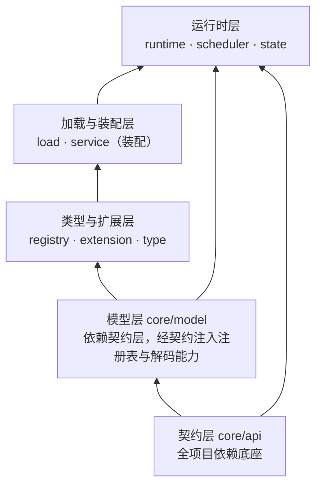

# 抽象层：服务端内核（`core`）

> 覆盖契约层、模型层、类型与扩展层、加载与装配层、运行时层（含调度）与掉落物状态。
> 只描述层次职责、核心契约与不变量；类级细节见 [../backend/README.md](../backend/README.md) 与各模块文档。
> 端到端链路见 [../flows.md](../flows.md)。

## 1. 层内结构与依赖方向

- **契约层**定义全部对外契约，被其余所有层引用；它不依赖模型、注册表与运行时。
- **模型层**依赖契约层，但不直接依赖注册表实现，只引用注册表契约。
- **加载层**不依赖模型层：模型以"解码契约 + 泛型"注入，装配层是两者的唯一桥接点。
- **运行时层**是唯一执行世界操作的地方，且只在服务端主线程执行。

## 2. 契约层（`core/api`）

| 契约族 | 内容 | 说明 |
|---|---|---|
| 类型定义契约 | 可注册类型的公共形态、类型注册表契约、类型分发工具 | 分发采用扁平式：类型专属字段与类型标识同级，不嵌套子对象 |
| 执行与求值契约 | 条件求值器、效果执行器、条件求值上下文、效果执行上下文 | 求值是只读纯谓词；执行器只做世界操作并返回真实回执 |
| 回执模型 | 条件求值四态、效果执行回执、可求值性门禁 | 结算记账的唯一依据 |
| 解码契约 | 单条规则 JSON → 模型 的解码契约、问题记录与问题累积器 | 加载层持有契约、模型层提供实现 |
| 查询契约 | 标签成员查询、气候采样 | 由运行时注入实现并缓存，求值器不直接访问注册表 |
| 常量与值 | 全部 JSON 字段名常量、通用引用值（注册表 id 或标签）、参数校验助手 | 字段名常量是唯一来源，禁止在别处散落字面量 |

**条件求值四态**是本层最重要的语义：命中、不命中、不可用、错误。只有"命中"通过；
"不可用"（上下文不足）与"错误"（求值异常）一律不触发；取反节点只互换前半两者，后两者原样穿透。

## 3. 模型层（`core/model`）

| 组件 | 职责 |
|---|---|
| 规则骨架 | 后端唯一配置单元：标识、启用、优先级、展示名、备注、源匹配、条件树、触发秒数、消失方式集合、效果或候选结果、固定成本、组合模式、schema 版本号 |
| 源匹配 | 匹配项集合 + 排除项集合；排除优先 |
| 消失方式与组合模式 | 消失方式与候选组合模式的枚举，解析大小写不敏感、未知取值报错（无静默回退） |
| 固定成本 | 源物品按引用配置的每组消耗量；催化剂按引用配置的每组消耗量、缺省数量与作用半径 |
| 候选结果 | 规则内唯一标识 + 共同执行的效果集合 + 候选级位置策略（安全生成、起点填充） |
| 条件树 | 递归节点：全部成立、任一成立、取反、条件叶；树只有唯一根，空表示无条件 |
| 类型定义形态 | 效果类型 / 条件类型契约与"一行式"实现形态；参数对象同时充当规则中的效果或条件叶 |
| 编解码组装 | 规则 / 条件树 / 效果的编解码组装入口与默认值；条件树编解码为递归自引用结构 |
| 语义校验 | 结构档（不依赖注册表）与参数档（依赖注册表）两档入口；问题写入问题累积器 |
| 规模上限 | 条件树叶数 / 节点数 / 深度、效果数、源项数、展示名码点数的唯一常量来源 |

**关键不变量**：

- 模型对象不可变；"修改"即构造新对象，集合对外为不可变视图。
- 编解码层**不得产出 null**：可空字段以可选值承载，末步回落。
- 规则必须且只能声明"平铺效果"或"候选结果"之一。
- 同一规则内同一消耗类型只能出现一次。
- 旧格式（条件数组、分组对象、叶级取反、整数形式的催化剂成本）一律明确报错，不做静默兼容。

## 4. 类型与扩展层（`registry` · `extension` · `type`）

**注册表语义**：注册期可写、冻结后只读。冻结后再注册抛异常，重复标识抛异常（绝不静默覆盖）；
注册期只允许单线程写入，冻结后任意线程可并发读。装配顺序固定：先条件、冻结、构建条件表达式编解码，再效果、冻结——
原因是效果记录可以携带**效果级条件**，必须已有完整的条件编解码能力。

**内置类型**（10 个条件 + 10 个效果）：

| 类别 | 内容 |
|---|---|
| 条件（10） | 维度、群系（精确或气候采样）、天气、露天、周围方块、催化剂存在、流体存在、时间、Y 坐标、光照 |
| 生效效果（7） | 生成实体（物品 / 通用实体 / 经验三个变体）、放置方块、战利品表、闪电、爆炸、箭雨、天气 |
| 消耗效果（3） | 消耗源物品、消耗催化剂、消耗流体 |

**一次性世界效果**（闪电 / 爆炸 / 箭雨 / 天气）在类型定义上标记为一次性：不随分组轮次放大、不参与容量计算。
**上下文门禁**：某些条件在信息不足时（如周围区块未加载）应返回"不可用"而非"不命中"，
由求值层映射为四态中的"不可用"，取反也不会把它当作不成立。

**第三方扩展 SPI**：以服务发现方式加载的规则类型提供者，两阶段调用——先注册条件、再注册效果，
使效果级条件可以使用扩展方自定义的条件。约束：使用自有命名空间；编解码必须暴露完整字段集合；
注册时机不可跨阶段；扩展包必须在服务端安装并满足加载器依赖声明。

## 5. 加载与装配层（`load` · `service` 装配部分）

**三层来源与优先级**（同 id 后者覆盖前者）：

| 层 | 位置 | 可写 |
|---|---|---|
| 内置数据包 | 模组 jar 内的规则目录 | 否 |
| 世界数据包 | 存档数据包内的规则目录 | 否 |
| config 覆盖层 | `config` 下的规则目录 | 是（编辑器与命令的写入目标） |

**流水线**：读取（三层）→ 按 id 合并 → 逐条解码 → 结构与参数校验 → 动态引用校验 → 交由运行时构建候选索引。

- 层内顺序由"层优先级、包优先级、文件路径、文件内顺序"共同决定，合并遵循后者胜；
  同名资源的所有副本都参与合并，而不是只取最高优先级一份。
- **控制条目**（停用 / 删除）只在覆盖层合法，在数据包层出现即拒载；合并时**普通条目先合并、控制条目后应用**，
  因此控制语义不受文件名顺序影响。控制字段必须按**取值**判定，而非按字段存在判定。
- **规则标识**：文件内可显式声明；单条规则文件可省略并由路径推导；多条目文件必须逐条声明，
  同一文件内重复标识中后者拒载。推导规则在读取侧与写入侧必须保持一致。
- 一个文件可以是单条规则对象或规则数组；解码器异常必须保留完整堆栈与可定位信息，不吞掉。
- 体积较大的清单（周围方块等）有工作量上限，超限拒载。

**失败语义**：枚举资源或目录失败时，调用方必须**保留上一版规则继续服务**；单个坏文件 / 坏规则只拒载该条，其余继续。

## 6. 运行时层（`runtime` · `state`）

### 6.1 追踪与排期

- **进入追踪**：掉落物入世界后先做排除判定（已移除、空、原版无限寿命、死亡掉落锁、已提交转化），
  再查候选索引；**没有候选规则的掉落物零成本不追踪**。已追踪实体去重。
- **首次排期**：触发时刻取"候选规则中最早的触发秒数"与"实体自然寿命减一"的较小值，
  以条件检查任务入队；因此规则永远不会晚于自然消失生效。
- **触发路径**：自然消失在原版销毁前拦截并立即检查；三类环境销毁在真实致死分支上归类后请求转化。
  两条路径共用同一请求入口与同一份追踪与预算。规则未声明该消失方式时不参与。

### 6.2 到期判定与规则选择

到期检查按顺序过滤：实体失效、区块实体 ticking 门禁、转化锁、永久禁转、转化冷却、候选是否为空；
随后逐条候选选择——只考虑声明了当前消失方式的规则，年龄门槛只对"非环境触发的自然消失"生效，
条件树必须返回命中。**同一次检查只执行优先级最高的一条命中规则**。
候选排序为：优先级降序 → 条件叶数降序 → 定义顺序。

未命中则按配置退避重试，退避基数可配置、位移有上限；若已过自然寿命或处于自然到期接管状态，则结束追踪。

### 6.3 完整组结算

命中后把**整堆源物品**转入结算库存，给实体打上持久的"已提交"标记（防止区块重进重复提交），
写一条可持久化的结算记录，并把结算作为效果类任务入队。结算分三阶段：

| 阶段 | 内容 |
|---|---|
| 计划 | 每组源成本 × 可容纳组数；容量（周围产物阈值）与催化剂可用量共同限制；候选按组合模式**选定其中一个** |
| 派发 | 逐组：先支付催化剂、再扣固定源成本、记录组已开始，然后按定义顺序派发效果（效果的延迟经调度器顺延） |
| 交付 | 剩余库存作为返还物分批加入世界；交付完成则结清记录 |

**数量守恒**：源物品初始总量 = 已消费 + 已交付返还 + 待交付返还。
只对**已开始的组**收费；概率落空、效果条件不满足、执行途中部分失败仍属已支付组（不免费重试、不返还）。
催化剂账目单独计数，不进入源物品守恒式。**计划量不得冒充成功量**：真实完成量只来自执行器回执与进度上报。

**组合模式**：默认轮询、可选优先级。轮询从持久化游标处依次尝试；容量或催化剂不足的候选跳过。
全部候选都无法完成一组时，整堆返还且不支付任何成本。组合模式不是"全部执行、只调先后顺序"。

**一次性效果**：不参与容量；仅含一次性效果的候选对同一源最多尝试一组。

### 6.4 持久化、恢复与实体状态

- 结算记录存于主世界的持久化数据；已完成且交付完毕的旧记录按时间与条数上限裁剪，**未结清记录一条不裁**。
- **中断**（重载 / 维度卸载 / 停服）走同一条中止路径：以当前库存同步待返还量、记录中断或失败、释放未支付的催化剂预留、写盘；
  该路径**不做任何世界写入**（卸载或停服时加入世界不安全）。
- **恢复**只交付记录中的待返还库存，**不恢复旧效果队列、不重放已开始的组**；同一记录同一时刻只允许一个交付任务。
- **实体状态**只挂在实体上、不进物品堆叠：新产物有临时环境伤害保护与转化冷却；返还物在其生命周期内永久防环境伤害、永久禁转。
  计时使用绝对游戏刻（卸载不暂停、重启后继续）；时长由配置在引导时注入，取 0 表示不授予。
  保护只豁免三类环境伤害；合并实体时永久标志不一致则禁止合并。

## 7. 调度与预算（`runtime/scheduler`）

**一句话模型**：整个服务器只持有一个调度器，所有维度与任务种类共享一份每 tick 时间软预算与全局工作量上限，
按"维度 × 任务种类"分道公平轮转；预算耗尽的任务保留原始到期刻跨 tick 延后，绝不静默丢弃。

| 要点 | 语义 |
|---|---|
| 任务模型 | 最小任务单元必须**单步有界**且不依赖平台类；步骤返回结果描述"让出 / 重试 / 完成 / 失败"与延迟 |
| 双上限 | 时间上限与工作量上限同时生效，任一耗尽即停止派发；每步按实际工作量计费，零成本步骤被强制为至少 1 |
| 效果类限额 | 效果类有单独的每 tick 工作量上限，防止效果吃光公共额度而饿死条件检查 |
| 搬运平滑 | 集中到期的任务在可配置窗口内摊平搬运，并有每道每 tick 的搬运上限；**不提前执行、不丢弃** |
| 取消 | 取消一律带原因并计入统计；区分"取消但保留维度"（重载 / 回扫）、"逐项上报后移除维度"、与"全部清空"（停服） |
| 观测 | 提供跨维度合并的任务 / 队列 / 预算快照，用于开发环境性能验证；软预算实测耗时**不能**作为 TPS 达标证明 |

配置变化的影响面：预算类参数在运行时构造时读取一次，**重载不重建调度器**，改动需重启服务端。

## 8. 索引与缓存（`runtime` 内）

- **候选索引**：把规则集合整理为"物品 → 候选规则"，直接物品建索引、标签懒展开并缓存成员，
  剔除不可运行规则（未启用或无可用候选），排序键为优先级降序 → 条件叶数降序 → 定义序。
- **门槛运行投影**：索引构建时把"留空"的催化剂门槛解析为当前消耗配置下的有效值；无留空门槛时复用同一规则实例。
  投影是索引构建的一部分，**没有独立缓存与失效入口**，随索引整体重建。派生值不写回用户声明。
- **缓存失效策略**：整体重建，不做单点失效。重载时重建索引、清空追踪、把依赖数据包的缓存置空、并带原因取消旧任务。
- **有界性**：气候采样按坐标缓存并有上限（超限淘汰最旧）；标签缓存对不存在的标签缓存空集；
  方块偏移表为进程内静态预计算，不随重载失效。

## 9. 扩展点

| 要做什么 | 落点 |
|---|---|
| 新增效果 / 条件类型 | 类型层新增参数对象与执行 / 求值实现 + 内置类型注册表登记；框架无需改动 |
| 新增规则级字段 / 消失方式 / 组合模式 | 契约层字段常量 → 模型层编解码与记录分量 → 语义校验与字段白名单同步 |
| 新增条件树节点类型 | 模型层节点定义 + 树遍历 / 统计 / 变换 + 编解码白名单 |
| 收紧或放宽校验 | 模型层语义校验；新上限统一加到规模上限常量处 |
| 新增任务种类 | 调度层任务种类枚举；统计按全枚举聚合会自动增项 |
| 新增依赖数据包的运行期派生值 | 索引构建期投影 + 挂到索引重建上，不要另建缓存 |
| 新增第三方类型注册 | 实现规则类型提供者 SPI 并以服务发现登记 |

## 10. 相关

- 各层类级细节：[../backend/README.md](../backend/README.md)
- 端到端链路：[../flows.md](../flows.md)
- 硬约束与使用约定：[../conventions.md](../conventions.md)
- 决策背景：`docs/adr/` 下的 ADR-0012 ~ ADR-0027
