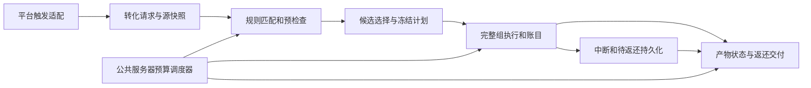

# 第二轮后端修改规划

状态：grill 已结束，玩法与行为契约已由用户确认；尚未实施代码。

源码调查参考：工作区 HEAD `2096019`，Minecraft 1.21.1、JDK 21、Mojang 官方映射、Fabric / NeoForge。

本规划独立记录第二轮目标，不替代现有实现说明，也不核对或修正用户正在处理的开发者文档。本文的类型名称与字段名是技术路线建议，实施阶段应结合现有代码定稿；已确认的行为契约不得因此改变。

## 1. 交付目标与范围

本轮拓展自然消失之外的销毁转化，加入结果组合选择、正确的消耗与返还结算，并通过公共调度预算降低集中检查和执行的 tick 耗时峰值。

优先级为玩法优先，架构与性能优化服务于这些玩法。交付范围包含服务端规则、执行 API、平台入口、持久状态与后续 GUI 所需契约；GUI、HUD、客户端交互和渲染留到下一轮。本轮新能力先通过数据包 / JSON 配置。

旧规则未声明消失方式时仅适用于自然消失。当前仍在开发阶段，用户确认旧规则只有内置数据包，本轮同步更新内置规则即可，不安排历史数据迁移。

## 2. 已确认的行为契约

### 2.1 触发与时间

| 消失方式 | 触发条件 | 转化等待时间 |
| --- | --- | --- |
| 自然消失 | 沿用自然消失转化机制 | 使用规则配置 |
| 火 | 最终致死伤害属于火，掉落物即将真正销毁 | 不等待 |
| 岩浆 | 最终致死伤害来自岩浆，掉落物即将真正销毁 | 不等待 |
| 仙人掌 | 最终致死伤害来自仙人掌，掉落物即将真正销毁 | 不等待 |

四种方式并列，一条规则可选择一种或多种。接触危险源、受伤但存活、原版免疫伤害均不触发。按最终致死伤害归因，不追溯最初着火地点；例如离开岩浆后被持续燃烧伤害销毁，归为火。

销毁当次接管源物品与转化请求，不额外设置转化倒计时。效果仍可配置显式延迟，并可受调度预算分批跨 tick 完成。即时转化不要求所有产出在同一 tick 生成。

规则不匹配时原掉落物正常销毁，不产生转化结果。其余规则匹配、原有规则优先级与条件系统尽量复用；本轮不将其它移除原因自动归入这四种方式。

### 2.2 检查结果冻结

只在转化前检查规则条件、效果条件及概率，确认后固定计划。执行时不再次判断这些条件，也不重新抽取概率；显式延迟只延后动作。

流体仅是实时存在条件，不以流体数量换算可执行组数。同一流体存在时，多个掉落物都可以通过检查。先执行的任务移除流体后，尚未检查的掉落物可能不再满足条件；已经通过检查的任务继续执行。不得新增执行前的流体二次检查。

保留流体条件现有配置能力，统一条件与消耗对同族流动变体的匹配语义。流体移除属于独立动作，不预留流体份数，不扫描流体总量，不按每组都必须获得一个流体方块来限制转化。

实际动作仍受引擎合法性约束：方块不能覆盖不可替换位置，创建实体和加入世界可能失败。必须记录真实成功结果，不把预检查通过直接当作生成成功。这些动作结果检查不构成规则条件的重复校验。

### 2.3 固定成本与完整转化组

源物品必须有正数消耗成本。取消源成本为 0 的行为；只配置催化剂或流体消耗不能关闭源消耗。不希望消耗的输入应作为催化剂，而不是源物品。

源物品与催化剂作为固定成本，不独立配置概率、条件或延迟。催化剂必须足量支付，不能少扣却照常产出。流体遵循 2.2 的存在条件与移除动作规则，不作为数量成本。

一组转化按固定源成本结算，不按比例拆成半组。例：每组消耗 2 个源物品、生成 3 个生物，源堆叠有 10 个，上限余量为 4 个生物，只执行一组，生成 3 个、消耗 2 个、返还 8 个。输入不足一组成本时不强行执行。

同一个候选结果包含多个产出效果时，它们共同限制完整组数。例：每组生成一个生物并放置一个方块，容量分别为 10 和 2，只执行两组。已知容量不足、催化剂不足或放置半径内位置不足，在开始该组之前处理。

规则匹配后，效果自身条件不满足或概率落空属于正常结果，仍消耗该组；不因此改选候选或返还成本。概率落空不能成为免费重试。

### 2.4 组合结果

每个转化组只选择一个候选结果；一个候选内部可包含多个共同执行的效果。

| 组合模式 | 选择行为 |
| --- | --- |
| 轮询（默认） | 从游标开始依次选择候选，确认一组选定结果后推进 |
| 优先 | 从列表开头选择第一个可以执行完整一组的候选 |

容量不足的候选跳过，继续尝试其它候选；全部候选无法完成一组时返还剩余源物品。不能将结果组合误实现成“全部结果执行，只调整先后顺序”。

轮询游标按规则 ID 与维度共享，不因换一个源掉落物而从头开始；持久化保存，候选列表结构修改后重置。已经确认的任务使用冻结计划，新规则供后续请求使用；旧任务不再查当前规则以重选结果。

每组独立判断概率，预检查阶段固定判定；选中结果概率落空仍支付该组成本，不改选其它候选。

天气、爆炸、闪电等一次性效果不参与数量上限计算。仅含一次性效果的候选，对一个源掉落物最多尝试一组，之后跳过。含可重复数量产出的候选可以执行多组，但其中的一次性效果仍只尝试一次。纯天气规则配置消耗 1 个物品改变一次天气时，只消耗 1 个，其余返还。

### 2.5 已开始组与中断结算

已开始的一组支付完整约定成本。突发动作失败时记录真实成功量与失败，不补做、不重放，不把失败产物计为成功；可能发生已付成本但产出不完整，这是用户选择的失败策略。

例：一组消耗 2 个源物品，生物已经生成，但方块在允许范围内最终无法放置，仍消耗 2 个，记录一个生物及方块失败，不重新生成生物，也不在恢复后补放方块。

正常区块 / 维度卸载或停服时记录失败或中断，停止任务；再次加载时只返还尚未开始部分对应的源物品。已开始组不恢复执行。暂时无法加入世界的返还，保存为待返还记录，而非直接丢弃。

### 2.6 新产物与返还物状态

仅掉落物使用这套状态，生物和方块不获得环境免疫。

| 对象 | 环境保护 | 转化状态 |
| --- | --- | --- |
| 新产物掉落物 | 默认 2 秒，仅防火、岩浆、仙人掌伤害 | 默认 5 秒转化冷却 |
| 未消耗源物品的返还掉落物 | 本实体生命周期内永久防上述三种伤害 | 本实体生命周期内永久禁转 |

新产物保护与冷却分别采用服务端全局配置，允许设为 0；从实际生成时开始按服务端 tick 计时。服务器运行时持续计时，区块卸载不暂停；停服没有 tick 推进，重启恢复状态。临时冷却本身不免疫伤害，保护结束后仍可能被销毁；冷却期间真正销毁时正常消失，不延后转化。

返还物仍可拾取并按原版时间自然消失，但自然消失不触发转化。卸载或重启不解除永久状态；拾取后重丢是普通掉落物，不继承永久保护和禁转。返还必须保留源物品组件 / NBT 等数据，不只保留物品 ID 和数量。

保护、冷却、禁转状态不兼容的掉落物禁止合并；兼容时沿用正常物品合并，临时状态取较晚结束时间。状态放在实体层，避免随 ItemStack 进入背包后继续继承。

### 2.7 生成、放置与返还位置

生物安全生成作为可选能力，搜索以起点为中心的水平 5×5、上下各 2 格范围，选择最近位置；检查完整实体体积、火 / 岩浆 / 仙人掌危险，并按生物类型判断地面或水域。没有安全位置时回到原点生成，不让整条规则失败。等距位置使用稳定顺序即可。

方块起点填充作为可选能力，仍只替换可替换方块，并满足目标状态的合法放置要求。失败尝试下一个位置；成功填充计入原有放置数量，不额外增加产量。不得为了凑数突破最大半径或破坏实心方块、容器。对火或岩浆能否替换，按原版实际可替换性处理，不增加强制清空例外。

方块放置完成或任务中断结算后返还源物品，避免返还物被本任务后续放置埋住。优先选择起点附近、或本次放置方块上方的最近无遮挡位置；找不到时向上搜索至该维度限高，若一直有方块则在限高以上生成。不得因空间占满而无限等候或破坏已有方块。

保留当前 `spawn_item.limit` 的附近同类物品总件数语义，不新增掉落物实体数量上限。生物上限继续按同类型活实体计数。范围参数不得混淆：物品 / 生物的查询半径用于上限查询，生物安全生成范围另行定义；方块半径限制放置搜索。

## 3. 当前实现与本地 API 依据

以下是调查所得事实，不是已完成的第二轮实现。

Java 路径共同前缀为 `common/src/main/java/com/meteorite/itemdespawntowhat/`，下表相对于该前缀。

| 路径 | 已核实的现状 | 对本轮的影响 |
| --- | --- | --- |
| `core/runtime/ConversionRuntime.java` | 到期调度已有任务数和时间预算；预先计算轮数，产出不足不会回减消耗；源使用永久 converted 标记 | 改为明确组数、库存所有权、执行回执及返还结算 |
| `core/api/EffectExecutor.java` | 接口返回 void，无完成量或完成回调 | 支持分步完成、实际成功数、失败和中断通知 |
| `core/type/effect/exec/ConsumeSourceExecutor.java` | 直接扣实时源堆叠；源已死亡时跳过，无重建返还机制 | 销毁路径不能继续依赖活源实体扣数 |
| `core/type/effect/exec/SpawnItemExecutor.java` | limit 统计物品件数，产物不带保护或冷却 | 统一产物生成入口与实体状态 |
| `core/type/effect/exec/PlaceBlockExecutor.java` | 少放时没有补偿；实际 placed 数保留在内部 | 将真实结果纳入组账目 |
| `core/type/condition/eval/FluidPresentEvaluator.java` | 读取起点所在方块的实时流体；require_source 表示流体源头 | 复用存在判断，不增加体积浸没或流体库存统计 |
| `core/network/catalog/RuleCatalogService.java` | 提供候选分页、过滤与缓存 | 可复用查询，不应误当作完整字段能力描述接口 |
| `core/service/RuleEditService.java` | 已有版本冲突、验证、写覆盖层和重载失败反馈 | 复用保存链路并增加新契约校验 |
| `core/debug/RuleDebugCommands.java` | 开发环境已有 debug bench 与队列指标 | 复用性能观察入口，不新增 test 文件 |

本地 Level 2 查询经 IDEA MCP / mc-developing-mcp 完成，未联网、未使用 shell 反编译：

- Vanilla `ItemEntity.hurt(DamageSource, float)` 的实际致死分支中，health <= 0 后先调用物品销毁回调再 discard；此处仍可取得当前物品栈与伤害来源。NeoForge 对应分支类似，但销毁回调包含 DamageSource 参数。
- 已检查的 NeoForge 致死分支没有通用销毁事件；本地事件检索未找到足以覆盖本需求的 ItemDestroyedEvent。现有自然到期仍可用 ItemExpireEvent。事件搜索不代表所有第三方扩展都已穷尽。
- NeoForge EntityInvulnerabilityCheckEvent 可修改 isInvulnerableTo 的结果，ItemEntity.hurt 会经过这条路径，适合仅对受保护掉落物及指定伤害生效。
- 已检查的两平台 ServerLevel / PersistentEntitySectionManager 添加路径及 Entity 坐标设置，不按建造限高拒绝或钳制实体；NeoForge 加入世界仍可能被 EntityJoinLevelEvent 拒绝。高空生成、存档、落地仍需游戏内验收。
- Entity Tags 可随实体保存恢复；原版掉落物合并不处理本模组的保护状态。定时数值状态的保存入口、精确伤害分类与注入映射仍应在阶段 0 / 3 核实。

## 4. 目标架构与技术路线

### 4.1 职责拆分



公共代码负责规则、候选选择、固定成本、库存与容量预留、执行回执、返还和调度。平台代码只提供自然到期 / 实际销毁入口、保护事件或最小 Mixin、存取状态与生命周期适配。

Mixin 只做入口分派或保护判定，不容纳规则匹配、产物生成与结算业务。common 不 import 平台类，服务端路径不引用客户端类。世界读取、写入与结算保持服务端线程执行，不用线程池并行修改世界。

### 4.2 规则概念结构与 API

```text
规则
  消失方式集合（默认仅自然消失）
  源匹配与规则条件
  自然消失转化时间
  固定成本（正数源成本、催化剂数量成本）
  组合模式（默认轮询）
  候选结果列表
    候选标识
    效果列表（同一候选共同执行）
      效果参数、条件、概率、显式延迟
      可选安全生成 / 起点填充
```

这是概念结构，不是可直接加载的 JSON；阶段 1 定稿字段和 Codec。尽量复用现有条件树、效果类型注册与规则覆盖层，不同时引入另一套表达式系统。相互独立的候选选择与候选内共同效果需要分别建模。

阶段 1 的默认值技术建议：未显式配置源成本时每组 1 个，安全生成开关默认关闭以沿用原点行为，起点填充默认开启以沿用原先中心位置尝试；这些是实施定稿建议，不冒充访谈中已经逐项确认的开关默认值。

API 必须表达：触发来源、完整源栈快照、固定位置、规则版本、候选 ID、组编号、已确定条件 / 概率、一次性效果尝试记录、实际成功量、失败原因、中断与结算状态。

保存链路同步更新 Codec 白名单、语义验证、候选引用、正数源成本与固定成本约束；保留权限检查、版本冲突和 SAVED_NOT_RELOADED 等已有反馈。

后续 GUI 所需能力描述至少包含触发选项、组合模式、候选 / 效果结构、固定成本与可选生成策略；读快照与写规则使用同一版本契约，错误定位到具体字段。旧 GUI 无法表达新结构时拒绝可能丢字段的保存；保持项目编译，通过 common 层必要的访问兼容适配实现过渡，不新增 GUI 控件。

### 4.3 所有权、预留与数量账目

源快照必须与原实体所有权转移绑定，不得一边保留可拾取的原堆叠，一边按完整快照生成或返还。对接管的实际销毁请求，避免原版物品销毁副作用与模组返还同时执行造成重复物品；未接管请求继续原版流程。同一源请求去重，进入结算一次。

通过预检查后，由任务持有源库存与可执行组计划；预留催化剂及产出容量，防止本模组多个待执行任务重复使用相同库存或剩余上限。预留库存不等于已经消费，实际开始一组时才记账支付。尚未开始部分释放容量，并返还未消费库存；催化剂预留也必须正确释放或恢复，不能因终止源任务而吞掉未付出的催化剂。

不预留流体数量。源库存与催化剂预留用于避免执行时重新依赖已死亡源实体或已被拾取的成本输入，不能通过预留去新增规则条件复查。

设源初始数量为 N，每组源成本为 c > 0，实际开始组数为 g：

```text
可支付组数上界 = floor(N / c)
已消费源数量 C = c × g
应返还源数量 R = N - C
结算守恒：N = C + 已交付返还 + 尚待交付返还
```

计划组、已开始组、成功效果与失败效果分别计数。概率落空属于已支付组，执行途中部分失败也属于已支付组；生成数量记录每个效果的真实成功量，不能用 planned × count 替代 actual。源成本不足一组时不得沿用旧 max(1, N / c) 强制产出。

建议状态流为：请求接收 → 预检查 → 计划确认 → 组开始 / 成本支付 → 实际效果回执 → 完成或失败 → 剩余结算 → 返还交付。持久记录必须能区分已消费、已交付与待交付，防止重复返还。

### 4.4 实际销毁入口与保护

NeoForge 自然消失继续优先使用现成 ItemExpireEvent；环境保护优先使用已核实的 EntityInvulnerabilityCheckEvent，并严格限定对象与三类伤害。Fabric 通过最小伤害入口实现同等保护。

实际环境销毁先复核 NeoForge 事件是否能提供致死前源栈和原因；若仍无等价 Event API，两平台各自用最小 Mixin 接 ItemEntity.hurt 的致死分支、物品销毁回调之前。不同平台回调签名不同，不强行共用未经验证的注入描述符。不得仅在 hurt HEAD 判断“碰到了危险源”就启动转化。

保护判定发生在原版伤害扣除之前；转化启动只发生在真实致死分支。分类由 common 的原因解析负责，岩浆具体来源与火类别重叠时先区分岩浆，再分类其它火伤害；不把未知伤害自动归为火。

### 4.5 实体状态与持久返还

使用实体层状态记录临时保护、临时冷却、永久保护和永久禁转，加载时恢复，卸载时释放运行期引用。计时使用可持久的服务端 tick 时间基准，避免重启后 tick 计数归零导致保护时间被重新赠送；具体存取钩子在本地 API 验证后定稿。

轮询记录至少保存规则、维度、候选结构版本与游标。中断记录保存完整源栈、已开始组数、实际结果和待返还数量。正常卸载 / 停服关闭任务时先形成可保存的结算记录，再释放队列，不能沿用旧清队列即丢任务的策略。

返还交付成功后才从待交付量中扣除；加入世界失败应保留记录并重试，不能同时算已交付。几何空间不足按向上 / 限高以上方案立即确定可生成坐标，不进入无限等待空间的分支。大量竖向位置搜索同样分步受调度预算约束。

### 4.6 可复用的服务器预算方案

公共调度器面向任务接口，不依赖 ItemEntity 或具体效果；由服务器拥有一个实例，任务携带维度、种类、到期 tick 与可续接进度。

建议任务接口表达单步执行、完成 / 让出 / 失败、资源释放和中断通知。业务执行器负责把长循环拆成有界步骤，预算协调器负责到期、公平性与时间统计，禁止在两处分别创建完整服务器预算。

核心策略：

1. 每 tick 创建一个总时间预算及工作量限额，各维度、检查 / 效果 / 返还类型公平轮转，共享剩余额度。
2. 到期桶转移、就绪任务提取、条件检查、位置搜索、执行和返还都计入预算；不能先无限搬运全部到期任务再开始计时。
3. 批量同龄掉落物的自然检查在可配置窗口内分散；这是允许的时间精度让步，窗口在测量阶段定稿。
4. 到期任务保留原始时间，跨 tick 延后不丢弃；跟踪积压与最大等待，避免新任务长期挤占旧任务。
5. 任务到等待时间才参与执行，不能因公平轮转提前执行配置延迟。
6. 不能为了赶上积压直接绕过总预算。正常中断通过任务通知结算；不把“本 tick 预算耗尽”当作业务失败或部分返还。
7. 使用软时间预算：普通 Java 调用不能被安全中途抢占，单步过长必须进一步拆分或优化。既有 API 或第三方单次调用超时不能由计时器硬截断。
8. 世界访问仍在服务端线程，平台只接一次公共服务器推进入口，避免维度事件重复推进同一总预算。

配置候选包括总预算、每 tick 工作量上限、自然检查平滑窗口及分步规模；默认值由阶段 0 基线与阶段 7 对照决定，不把访谈中的 2 tick 示例当作已接受上限。过载会延后，不能同时承诺任意负载下固定延迟和固定耗时。

## 5. 实施阶段与依赖

### 阶段 0：基线、API 与入口核实

**目标**：确定峰值发生在哪个步骤，补齐实际销毁、状态存取、卸载存盘与高度生成的 API 依据。

**工作与路线**：复用 debug bench，区分到期搬运、检查、规划、效果与返还耗时；记录单 / 多维度、同龄集中掉落的队列积压及 tick P95/P99。复核伤害源分类、两平台事件 / 注入点、实体保存与合并、区块和停服回调次序。优先本地 Level 2 查询，只有 Level 2 无法解决且确需 Level 3 时说明理由并询问用户。

**验收**：留存同环境基线及可重复场景；每个侵入入口有原版 / 平台源码依据；明确总预算与平滑窗口初始候选值。不得先写未经核实的宽范围 Mixin。

### 阶段 1：领域模型、规则契约和 GUI API

**目标**：让新触发、固定成本、候选组合成为可验证、可传输的规则契约。

**工作与路线**：调整 Rule / RuleCodecs / RuleValidation / 类型注册，区分固定成本和效果；加入触发集合、默认轮询、候选稳定标识与结构版本、一次性效果分类和可选位置策略。同步编辑快照、保存验证及能力描述；更新内置数据包，保留必要 common 访问适配使现有客户端源码可编译。

**验收**：源成本 0、成本概率 / 条件 / 延迟等非法配置被拒绝；未声明方式仅自然；候选结构可完整往返，旧 GUI 不能无声抹掉新字段。数据包是本轮新能力的配置入口。

### 阶段 2：公共调度器基础

**目标**：先建立可供后续执行链复用的预算和中断接口。

**工作与路线**：拆分或替换现有 TickScheduler，统一服务器预算、维度与任务种类公平轮转、逐步到期搬运、延迟保持与取消通知；让已有自然检查接入，避免保留一套独立维度预算导致耗时倍增。

**验收**：多维度共用一个预算；同 tick 大量到期不会在预算外全量处理；延后任务不丢、延迟不提前、队列推进不重复。此阶段提供后续业务所用接口，不独立扩建通用外部库。

### 阶段 3：环境销毁入口与掉落物状态

**目标**：四类触发使用公共请求路径，保护与冷却正确保存、计时和合并。

**工作与路线**：保留现有自然入口，添加致死前最小适配；将伤害分类、请求去重、源所有权接管交给 common。NeoForge 保护使用 Event，Fabric 用最小入口；落地实体状态及保存 / 加载 / 合并兼容策略。

**验收**：仅真实致死触发，不因接触、受伤存活、免疫而转化；火与岩浆归因正确；只有指定伤害受保护；拾取重丢解除返还实体状态，原版自然过期不被保护阻止。

### 阶段 4：预检查、结果选择与成本结算

**目标**：用完整组和实际账目替代预估 rounds 后无反馈执行。

**工作与路线**：建立冻结计划、源 / 催化剂库存所有权、容量预留、候选选择、共享游标与每组概率结果；改变 EffectExecutor / EffectContext 以支持分步和实际回执。源成本在组开始记账，未开始库存仍可返还；流体不计数、条件不复查。

**验收**：10 源 / 每组 2 源 / 每组 3 生物 / 余量 4 得到 3 生物与返还 8 源；候选内多个产出用最小完整容量；轮询跨实体接续并重启保存；概率落空消费但不回退；天气独立一次只按配置扣源。

### 阶段 5：安全生成、方块放置与返还位置

**目标**：让空间限制真实影响组数，返还物始终有明确且不被本任务埋住的位置。

**工作与路线**：在 SpawnEntityExecutor 实现可选有界最近安全搜索及原点回退；PlaceBlockExecutor 输出真实放置结果，仅可替换位置，从失败点继续；统一 SpawnItemExecutor / 返还生成入口，保持完整源数据，添加对应实体状态。返还搜索在公共预算内分步执行，并提供限高以上最终坐标。

**验收**：水生 / 陆生目标的安全检查正确；找不到回原点；起点填充不多产、不破坏不可替换方块；有限半径不足不强行扩张；返还不被新方块埋住，满高柱使用限高以上坐标。

### 阶段 6：正常中断、持久返还与恢复

**目标**：区块 / 维度卸载与正常停服不会吞掉未开始源物品或重放产出。

**工作与路线**：接任务中断通知，保存已付成本、实际结果、失败和待返还记录；终止已开始组的剩余动作，不补做。释放未消费的催化剂 / 容量预留。恢复时只交付待返还库存，不恢复旧效果队列；保存共享轮询进度与实体状态。

**验收**：延迟执行前关闭服务器返还全部未开始源库存；部分执行后只返未开始组对应库存；重新加载与重复交付调度不会多生成或多返还；目标区块不可用时记录不丢。

### 阶段 7：削峰调优和整体验证

**目标**：以测量结果收敛预算、平滑窗口和分步大小，确认新增玩法未破坏数量契约。

**工作与路线**：使用阶段 0 相同条件对照，分析 tick / 各任务类型 P95、P99、最大值、积压、最大就绪延迟和积压清空时间；覆盖自然集中到期与环境集中销毁。按数据选择默认配置，检查候选规划、容量预留和返还竖向搜索是否成为新峰值。

**验收**：在同规模同环境下，目标检查 / 调度步骤的集中峰值改善；不能仅把峰值转移到预检查、返还或队列搬运。输入停止后积压能清空，数量账目满足矩阵。具体数值以阶段 0 留存基线和实施前确定的测量阈值为准，不预先宣称毫秒收益。

依赖顺序：0 → 1 → 2 → 3 → 4 → 5 → 6 → 7。各阶段只在契约与验证通过后继续，客户端接入属于后续独立规划。

## 6. 游戏内验收矩阵

测试由用户执行，不新增 test 文件。

| 场景 | 预期 |
| --- | --- |
| 旧规则无消失方式 | 仅自然消失触发 |
| 多选方式的同一规则 | 对各选中方式复用条件与结果 |
| 碰火但未死、耐火物入岩浆 | 不触发销毁转化 |
| 火 / 岩浆 / 仙人掌实际致死 | 进入对应即时请求，无转化倒计时 |
| 岩浆离开后的持续燃烧致死 | 归为火 |
| 规则不匹配 | 正常销毁，无返还或产物 |
| 不足一组源成本 | 不强制产出，剩余按结算返还 |
| 生物 / 物品件数上限不足完整组 | 不做半组，剩余源返还 |
| 候选内多个效果容量不同 | 完整组数受共同约束 |
| 单个源物品连续投入轮询规则 | 跨实体按规则与维度接续 |
| 轮询或优先当前候选已满 | 跳到下一可用候选 |
| 候选全部不可用 | 未消费源返还 |
| 概率落空 / 效果条件不满足 | 该组仍支付，不改选免费重试 |
| 纯一次性效果与组合一次性效果 | 按规定次数尝试，不随无限容量重复 |
| 流体先存在、通过检查后被移除 | 已通过任务执行，后来才检查的可失败 |
| 生物安全点不存在 | 原点生成，不否决整条规则 |
| 方块候选位置被后来占据 | 不覆盖不可替换方块，尝试其它位置，记录实际结果 |
| 已开始组部分失败 | 扣整组成本，记录失败，不补齐、不重放 |
| 新产物保护结束但冷却未结束时被销毁 | 正常销毁，不转化 |
| 返还物火 / 岩浆 / 仙人掌、原版自然过期 | 前三者受保护，自然过期正常消失且不转化 |
| 不兼容状态合并、拾取重丢 | 不污染其它物品状态，重丢普通 |
| 方块放置后的返还、满高柱返还 | 不埋入本任务方块，必要时在限高以上生成 |
| 延迟效果尚未开始时停服 / 卸载 | 记录并返还未开始库存 |
| 部分执行后重载、重复交付尝试 | 已成功效果不重放，已返还物不再返还 |
| 服务端 tick 计时与重启 | 临时状态不因加载刷新时长，永久状态保留 |
| 旧 GUI 写入不能表达的新结构 | 明确拒绝有损保存 |
| 单 / 多维度大量同龄物、集中环境销毁 | 总预算共享、执行可延后、数量正确、积压可清空 |

## 7. 验证顺序、限制与后续动作

代码实施阶段先通过 IDEA MCP 检查 git 工作区错误 / 警告（忽略 Markdown 格式问题），再执行：

```powershell
powershell -ExecutionPolicy Bypass -File tools/dsh-build.ps1 -Tasks "build"
```

不得裸跑 gradlew；确认上一次构建结束后才能再启动。构建跟踪至少按项目要求持续等待 120 秒窗口，运行中的任务持续等待到结束。失败先修复并复验；原因不明或需改变设计时停止并说明。所有新增类加中文类注释，方法注释用中文；涉及可见文本时同步 en_us / zh_cn 本地化。

当前交付仅 Markdown 规划，不需要格式校验、IDEA 代码检查或构建，也未运行游戏测试。

**已知限制**：尚无本轮游戏实测与性能收益数据；动作合法性、第三方加入世界事件或其它改动可使已开始组部分失败，用户选择付完整成本且不补齐。预算为软预算，无法硬抢占一次 Java / 第三方调用；高负载允许排队延后。直接生成链路允许限高以上坐标，但高空落地与存档需实测。正常停服 / 卸载的可靠结算要在阶段 6 实现，当前旧队列没有该保证。

**假设**：实施时 loader、Minecraft、映射和可用事件没有变更；如变更，阶段 0 重新核实，不能沿用旧注入签名。

下一步从阶段 0 开始，确认源码 API 和用户基线测量，再实施阶段 1 的规则契约；不要直接跳到销毁 Mixin 或让前端承担新结算逻辑。

## 附件

- [本轮术语](CONTEXT.md)
- [预检查、完整组与中断结算决策](docs/adr/0001-conversion-commitment.md)
- [公共服务器预算决策](docs/adr/0002-shared-server-budget.md)
