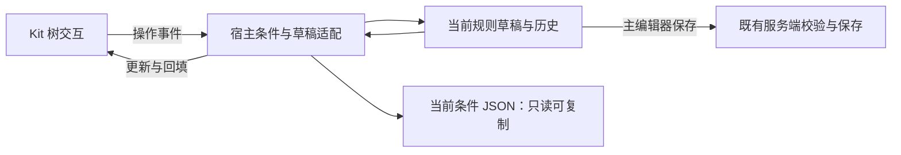

# 条件树编辑改进规划

状态：第一阶段可靠性与信息展示、统一撤销快捷键已合入集成分支并通过工程验证；第二阶段页面与 Kit 重构正在实施。游戏内验收尚未完成。

任务规格：[条件树可视化编辑与统一撤销](../../../.scratch/condition-tree-editor/spec.md)，状态为 `ready-for-agent`。

## 目标

让条件树在未填写完成时仍可持续编辑，错误能定位到字段，并通过大屏叠加页完成结构整理与参数编辑。保留现有配置格式、条件运行模型与服务端权威校验。

## 已确认范围

| 事项 | 已确认决策 |
| --- | --- |
| 实施顺序 | 先修复编辑可靠性和信息展示，再增强树操作。 |
| 页面重构 | 重构现有条件树编辑页面，保留原数据结构和业务逻辑，替换交互层与可视化层；条件树使用大屏叠加编辑页。 |
| 配置与运行语义 | 保持现有 JSON 结构；本轮目标是重构编辑手段。 |
| 树编辑能力 | 支持添加子节点、删除节点、编辑条件、拖拽调整层级与顺序、折叠与展开、缩进展示、选中与批量操作，并提供实时预览与即时反馈。 |
| Kit API | Kit 提供通用树的创建、删除、移动、查询、选择与交互事件；宿主提供条件规则与 JSON 编解码，通过注入接口接入 Kit。支持页面双向绑定，提供接口文档或类型定义，保持现有 Kit 依赖约束。 |
| 页面布局 | 以缩进树为主视图，宽屏左侧树、右侧所选节点参数，窄屏切换至参数面板。 |
| 双视图切换 | 面板顶部提供树形视图与 JSON 源码视图切换，默认显示渲染树；JSON 源码只展示当前编辑的条件表达式，不展示整条未完成规则，内容来自当前草稿，格式化缩进、只读可复制，并随树编辑同步更新。 |
| 叠加页关闭与保存 | 树编辑直接更新当前草稿，返回主编辑器后保留修改；共用主编辑器撤销与重做，主编辑器保存操作才提交至服务端配置。 |
| 首版批量操作 | 包含批量删除、复制与粘贴、拖拽移动，以及将同父连续选中的节点包装为 AND 或 OR 组；条件参数逐节点编辑，不批量覆盖不同条件的参数。 |
| 撤销粒度 | 一次拖拽、批量删除、粘贴或包组各记一条；一个参数字段的一次完整编辑记一条，不按每个字符记录。视图切换、选中、折叠与展开不进入配置撤销历史；取消拖拽与无实际变化不产生记录。 |
| 撤销快捷键 | 本模组编辑器所有页面、表单和叠加层统一使用 Ctrl+Z；可编辑文本框聚焦时优先撤销当前文本编辑，其他情况撤销当前规则的草稿操作；一次按键只撤销一次，弹层不穿透到底层，各规则历史保持独立。Kit 提供通用派发能力，宿主提供撤销对象。 |
| 重做与按钮 | 同时支持 Ctrl+Shift+Z 和 Ctrl+Y 重做；保留撤销与重做按钮，并在 Tooltip 中标注快捷键。 |
| 空树与空 NOT | 整棵页面树为空时显示“＋ 添加条件”；NOT 唯一子项被删除或移走后保留 NOT，在内部显示相同添加入口；空 NOT 属于未完成草稿，补齐前阻止正式保存，不自动删除 NOT。 |
| 拖拽限制 | 不得移入自身或后代；条件叶不能接收子节点，NOT 不能接收第二个子节点；超过现有深度、节点数或叶数上限时拒绝操作。 |
| 非法落点反馈 | 拖动时标出落点，非法落点显示简短原因；松手后保持原树，不自动替换、删除或合并节点。 |
| 实时反馈 | 提供结构变化、条件摘要、错误定位与拖拽落点即时反馈；本轮不包含游戏环境求值预览。 |
| 字段错误 | 用户填写参数后校验合法性，定位到具体出错字段并在对应位置标记。 |
| 提示文案 | Tooltip 与错误提示简洁、平铺直叙，只说明哪里错、怎么改，不堆背景说明、不重复字段名、不使用无用修饰词。 |
| 未知条件 | 客户端无法识别的条件叶保留原始内容并标为只读，其他已识别节点仍可编辑；提交仍由服务端校验。第三方完整参数编辑另行规划。 |
| 未知叶结构操作 | 允许移动、复制、删除，以及包装进 AND、OR 或 NOT；内部参数只读。移动或复制完整保留该叶的 JSON 内容，不补默认值、不丢未知字段。 |
| 未完成参数输入 | 本次编辑会话内保留尚未完成或不合法的输入，切换树与 JSON 视图、返回主编辑器再进入时仍可继续修改；标记错误并阻止正式保存。 |
| 参数输入与源码关系 | 非法文本不写入 JSON；源码显示当前草稿中该字段最近已接受的值，并提示有未完成输入。空组等结构中间态保留在树草稿中，并标记缺少的条件。 |
| 参考方案 | 调研开源仓库中简洁的可视化树编辑方案，给出选型或融合建议。 |
| 技术要求 | 兼容现有技术栈，避免过重第三方依赖，合理拆分可复用部分，便于扩展、维护与验证。 |
| 当前工作边界 | 按已确认规格实施；只将确认的决策纳入实施规划。 |

## 决策依据

- 项目现有条件树与四态求值契约：[ADR-0018](../../adr/0018-condition-tree-contract.md)。
- 项目现有 Kit 依赖与宿主职责：[ADR-0025](../../adr/0025-reusable-client-ui-kit-boundary.md)。
- 当前 Kit 公开能力：[UI kit API](../../dev/internals/ui-kit-api.md)。

上述文档作为当前实现依据；本规划尚未构成新的已实施架构契约。

参考方案的事实与未确认建议见 [规划调研资料](research.md)；调研建议不自动构成本规划的已确认决策。

## 当前源码核对

以下为静态调用链结论，尚未在游戏界面复现。

| 问题或约束 | 当前证据 |
| --- | --- |
| 空组草稿重载会失去树编辑能力 | `UiConditionTreeEditor#addGroup` 创建空组；`RuleDraft#decodeConditions` 使用严格解码，空组被拒绝；`FormControl.ConditionTreeControl` 将整个条件树切换为只读原始内容展示。 |
| 未知叶导致整树只读 | 未注册类型在 `TypeDispatch` 解码失败，当前表单没有局部未知叶的编辑表示，使用整树只读回退。 |
| 收起子树后的诊断展示不完整 | `UiConditionTreeEditor` 的可见行遍历在收起节点停止，也停止收集后代的详细问题；整树有效性检查仍覆盖完整表达式。 |
| 叶行缺少参数摘要 | 当前叶行只展示条件类型标题；现有自然语言摘要实现可作为复用依据。 |
| 当前没有节点拖拽移动与多选 | `UiTreeView` 与 `UiConditionTreeEditor` 的拖动均用于滚动条，条件树只支持同父上移与下移、单选。 |
| Kit 尚无通用树编辑核心 | 现有树控件位于宿主 widget 包并依赖宿主主题，不能原样迁入 Kit。 |
| 撤销提交约束 | `EditSession#apply` 对有变化的操作保存一次快照；拖动预览须与正式提交区分，现有 Kit 输入生命周期提供参考。 |
| 撤销与重做现有入口 | 当前通过 `RuleEditorScreen` 页脚按钮进入，未找到键盘撤销或重做入口；历史属于当前规则的 `EditSession`，不是跨规则工作区历史。 |
| 快捷键作用域 | 当前屏幕优先向顶层模态派发；表单优先派发至聚焦控件，再处理容器导航。文本控件委托原版输入类，尚未核对原版类的局部撤销能力。 |
| 游戏求值预览未发现现有接入 | 当前客户端与网络协议中未找到条件求值预览入口；实际运行求值使用服务端上下文。 |

## 职责与数据流

| 部分 | 规划职责 |
| --- | --- |
| Kit | 通用树创建、删除、移动、查询、选择、折叠与交互事件；提供绑定和编解码注入接口，以及通用快捷键派发能力。 |
| 编辑器宿主 | 条件类型与参数表单、条件约束、草稿与未完成输入、JSON 编解码与源码展示、撤销对象、服务端提交。 |
| 既有 core | 保持正式配置解码、校验与四态求值语义；不以编辑中间态为由放宽运行配置契约。 |

树操作通过宿主更新当前草稿，草稿变化回填树与只读 JSON。拖拽预览只展示候选位置，确认有效操作后才提交一次变更；取消不改草稿。未完成文本保留在编辑状态中，不把非法文本伪装成已接受的 JSON 字段值。

## Kit 接口文档交付

- 说明节点访问、创建、删除、移动与查询的调用方式、参数含义和失败反馈。
- 说明宿主数据回填、操作事件、拖拽预览与正式提交如何区分。
- 说明编解码注入方式，具体条件 JSON 仍由宿主实现，Kit 不依赖 core、Gson 或平台类。
- 说明快捷键的焦点与弹层作用域，以及宿主如何提供撤销与重做对象。
- 实施落地后同步当前 Kit API 文档；实现前不把计划接口写成已存在 API。

## 实施时核对的细节

界面入口、布局尺寸和公开 Java 类型签名遵循上述行为与项目现有样式、输入及隔离约束，在实施时依据实际调用设计。本规划未指定未落地的类名或方法签名。

原版文本输入类是否已有可复用的局部撤销能力尚未核对，不能假定现有委托已经满足需求。实施须核对并实现已确认的焦点行为。

参考仓库用于比较交互与实现机制，具体算法与源码移植尚未选定；不把调研中的候选方案视为已确认依赖。

## 已确认交付与验收

| 阶段 | 交付与主要验收 |
| --- | --- |
| 第一阶段：可靠性与信息展示 | 空组重载后可续编；未知叶不拖累整树；未完成输入切页不丢；折叠子树的问题仍可定位；叶行展示参数摘要。 |
| 第二阶段：页面与 Kit 重构 | 大屏叠加页、树与只读 JSON 切换、多选与批量操作、跨层拖拽、即时反馈及 Kit 接口文档；一次操作可一次撤销，取消操作不改草稿。 |

两阶段保持 JSON 格式与运行语义。全局撤销与重做快捷键覆盖整个模组编辑器，阶段验收之外须完成下述统一快捷键场景。

### 人工验收场景

| 场景 | 应观察到的行为 |
| --- | --- |
| 整树为空 | 显示“＋ 添加条件”，可继续新增；无条件规则沿用既有语义。 |
| 空 AND 或 OR | 草稿重载后仍可编辑，显示缺项；正式保存被拦截。 |
| 空 NOT | 保留 NOT 和内部添加入口，补齐前拦截正式保存。 |
| 未完成参数 | 切换视图或返回主编辑器再进入后输入仍在，错误定位到字段，不能正式保存。 |
| 当前条件源码 | 默认显示树；顶部可切换到缩进 JSON，只读可复制，内容与当前条件草稿一致，不展示整条规则。 |
| 未完成文本与源码 | 源码保留该字段最近已接受的值，并提示存在未完成输入，不输出非法文本。 |
| 未知条件叶 | 已知邻居仍可编辑；未知叶内部只读，移动与复制后内容完整保留；支持明确删除和包组。 |
| 折叠与诊断 | 收起子树后错误仍能定位，不依赖展开状态判断完整树是否合法。 |
| 拖拽与批量操作 | 能改变层级与同级顺序，并完成已确认批量操作；非法落点有原因提示且原树不变。 |
| 结构撤销 | 一次拖拽、批量删除、粘贴或包组对应一次撤销；取消、无变化和纯视图操作不增加配置历史。 |
| 参数撤销 | 一个字段的一次完整编辑对应一次配置撤销，不逐字符记录配置历史。 |
| 全编辑器快捷键 | 不同页面、表单与叠加层均能使用 Ctrl+Z；文本框优先处理文本撤销，其他情况操作当前规则历史；一次按键不重复处理、不穿透弹层。 |
| 重做与鼠标入口 | Ctrl+Shift+Z 与 Ctrl+Y 均可重做；原按钮分别执行撤销与重做，Tooltip 标注对应快捷键。 |
| 规则历史隔离 | 编辑不同规则时撤销历史各自独立，不撤销另一条规则。 |
| 布局与文案 | 大屏树与参数分区，窄屏可切换参数面板；无重叠或不可达控件；提示只说明哪里错、怎么改。 |
| 保存边界 | 返回叠加页不丢草稿，正式配置仅由主编辑器保存提交，经既有服务端校验。 |

## 已知限制

- 本轮只有源码静态核对与开源资料调研，未进行游戏操作复现或性能测量。
- 未完成输入的保留范围为本次编辑会话，未承诺退出整个编辑器或重启游戏后恢复非法文本。
- 原文件空白排版不属于保留目标；JSON 视图是当前条件草稿的格式化表示。
- 第三方完整参数编辑与游戏环境求值预览不在本轮范围内。
- Kit 公开接口和新交互尚未实现，现有文档中的当前能力仍以源码为准。

## 验证约束

源码实施后先执行 IDEA MCP 检查，再进行 Kit 边界检查，并通过项目串行构建脚本验证；游戏内人工验收由用户执行，不新增 test 文件。

## 完成与归档

实施尚未完成，不归档本规划。全部实施与约定验收完成后，按项目归档目标、命名规则及索引约定归档，并更新引用入口；具体归档位置在收尾时核对。
