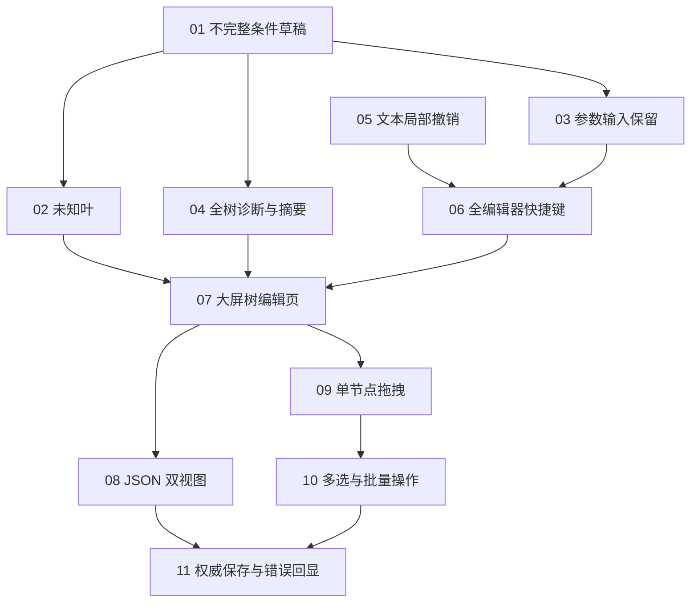

# 条件树编辑任务拆分草案

状态：任务粒度与阻塞关系已确认，11 张独立任务已发布，尚未实施完成。

依据：已确认的条件树可视化编辑与统一撤销规格。本草案不修改父规格，不构成实施完成记录。

## 拆分约束

- 第一阶段先修复可靠性与信息展示，并完成统一撤销基础；第二阶段交付大屏页面、双视图、拖拽与批量操作。
- 每张任务都交付可直接演示或验证的用户行为，所需重构、Kit 接口和宿主适配随该行为一起交付。
- 不单列只有接口、只有数据模型或只有文档的横向任务。
- 阻塞只表达必要的能力依赖，不表达同文件编辑冲突或仅为编号顺序而增加的串行关系。
- 不改变正式 JSON、条件运行模型、四态求值或服务端权威保存契约。
- 每张任务对实际落地的公开接口同步文档，遵守 Kit 隔离、本地化和项目验证顺序；不新增 test 文件，游戏验收交由用户。

## 第一阶段：可靠性、信息展示与撤销基础

### 01：不完整条件树可恢复编辑

**Blocked by:** 无，可立即开始。

**What it delivers:** 规则作者能先搭条件结构再补内容，空 AND、OR、NOT 不会在重载草稿后令整树变成只读；正式保存仍拒绝未完成结构。

- 空 AND、OR 切页或重载后仍可继续添加条件。
- 空 NOT 保留取反结构与内部“＋ 添加条件”；补齐前正式保存被拦截。
- 整树为空时展示“＋ 添加条件”，无条件表达式仍沿用既有业务语义。
- 将编辑草稿结构处理与正式配置解码分开，并在现有编辑流程中实际接入；保持已完成条件的参数与组合语义。

### 02：未知条件叶局部只读与内容保留

**Blocked by:** 01 不完整条件树可恢复编辑。

**What it delivers:** 一个客户端未知的条件叶不再使整树只读，作者仍能编辑已知邻居并安全保留扩展内容。

- 已知邻居仍可打开参数并修改，未知叶仅内部参数只读。
- 草稿重载和已知节点修改不丢未知叶字段、不补默认值。
- 已有结构入口能明确删除或包组未知叶；新的跨层移动和复制入口由后续任务接入相同保留契约。
- 不把客户端未知当成服务端必然无效，正式保存继续由服务端决定。

### 03：未完成参数保留与字段即时反馈

**Blocked by:** 01 不完整条件树可恢复编辑。

**What it delivers:** 作者能在本次会话内切页、返回后续填参数，错误定位到字段，非法输入不会污染 JSON。

- 本次会话内重载表单、返回再进入后保留未完成输入。
- 参数填写后提供可用的合法性检查，标记具体字段；提示仅说明哪里错、怎么改。
- 未完成或非法文本不写入配置 JSON，已接受字段值与未完成文本分别处理。
- 未完成必需内容阻止正式保存，一个字段的一次完整编辑对应一次配置历史，不逐字符记录。

### 04：全树诊断与叶参数摘要

**Blocked by:** 01 不完整条件树可恢复编辑。

**What it delivers:** 作者不必逐叶打开表单就能辨认条件，并能定位折叠子树里的错误。

- 叶行展示类型与参数摘要，已接受参数变更后更新。
- 完整树错误收集和合法性判断不依赖可见行，折叠不隐藏诊断结果。
- 错误能定位到对应节点与字段，展开状态不影响正式保存拦截。
- 复用现有摘要与本地化能力，不在正式配置中增加显示字段。

### 05：文本输入的局部撤销与重做

**Blocked by:** 无，可立即开始。

**What it delivers:** 作者在编辑器的单行与多行文本输入中能使用熟悉的撤销与重做，优先处理正在编辑的文本。

- 先核对现有输入委托的能力，不假定原版已经提供文本撤销。
- 文本焦点内 Ctrl+Z 撤销文本，Ctrl+Shift+Z 与 Ctrl+Y 重做文本；一次按键只执行一次。
- 操作当前输入时不撤销另一个字段或底层规则草稿。
- 实际接入现有文本输入与表单流程，不只提供未调用的历史类或接口。
- 文本局部历史与规则配置历史区分，不逐字符写入规则配置历史。

### 06：全编辑器配置撤销与统一快捷键派发

**Blocked by:** 03 未完成参数保留与字段即时反馈；05 文本输入的局部撤销与重做。

**What it delivers:** 作者在各页面、表单和弹层使用统一快捷键，文本焦点与当前规则历史各自得到正确处理。

- 非文本输入状态下 Ctrl+Z 撤销当前规则配置，Ctrl+Shift+Z 与 Ctrl+Y 重做。
- 文本焦点优先处理局部文本，一次事件只消费一次，顶层弹层不穿透到底层。
- 各规则历史独立；保留撤销与重做按钮并在 Tooltip 标注快捷键。
- 未完成输入保留行为与快捷键兼容，不因统一撤销入口丢失缓冲或误提交非法文本。
- Kit 提供通用派发和宿主接入，具体历史由宿主提供；接口在真实页面与弹层中使用。

## 第二阶段：可视化页面与 Kit 重构

### 07：Kit 驱动的大屏条件树编辑页

**Blocked by:** 02 未知条件叶局部只读与内容保留；04 全树诊断与叶参数摘要；06 全编辑器配置撤销与统一快捷键派发。

**What it delivers:** 作者能在宽敞的叠加页查看树、选择节点并编辑参数，保留第一阶段的可靠性与快捷键行为。

- 默认显示缩进树；宽屏左树右参数，窄屏可切换参数面板。
- 可新增、删除、查看与编辑节点，单选、折叠与展开可用；空树和空 NOT 添加入口可用。
- 接入未知叶、未完成输入、诊断、摘要与统一快捷键；返回主编辑器保留草稿。
- Kit 的通用创建、删除、查询、选择、绑定与操作事件通过实际页面接入；宿主提供条件数据与业务约束。
- 非法新增或修改不绕过原有结构与限额约束，纯视图变化不写配置历史。
- 同步已落地接口文档，不把条件模型、Gson、宿主主题或平台 API 引入 Kit。

### 08：当前条件的树与只读 JSON 双视图

**Blocked by:** 07 Kit 驱动的大屏条件树编辑页。

**What it delivers:** 作者通过顶部按钮在渲染树与当前条件的缩进 JSON 之间切换，源码只读可复制。

- 默认显示树，源码只展示当前条件表达式，不展示整条未完成规则。
- 已接受草稿修改同步更新源码，切换不产生配置历史、不丢未完成输入。
- 未完成字段的 JSON 保留最近已接受的值，并显示存在未完成输入的提示。
- 编解码通过通用注入能力接入 Kit，实际条件 JSON 仍由宿主实现，并在实际读入与展示流程中使用。
- 源码可选择与复制，不允许直接编辑，不承诺原文件空白排版保留。

### 09：单节点跨层拖拽与落点反馈

**Blocked by:** 07 Kit 驱动的大屏条件树编辑页。

**What it delivers:** 作者可以拖拽改变同级顺序或父节点，在松手前看清位置和非法原因。

- 支持同父重排与跨父移动，落点预览与实际结果一致。
- 拒绝自身与后代、叶子父节点、NOT 第二个子项及超限落点，显示简短原因且原树不变。
- 拖影或候选位置不提前写草稿，取消无变化，合法落下只提交一次且可一次撤销。
- 移走 NOT 唯一子项后保留空 NOT 与添加入口；未知叶移动后内容完整保留。
- Kit 移动与交互 API 在真实页面中使用，宿主负责条件限制，更新落点与生命周期文档。

### 10：多选与批量条件树操作

**Blocked by:** 09 单节点跨层拖拽与落点反馈。

**What it delivers:** 作者能多选并一次删除、复制粘贴、移动或包组，保留条件参数与一次操作一次撤销。

- 多选、批量删除、复制与粘贴、拖拽移动可用。
- 同父连续选中的节点可包装为 AND 或 OR；参数逐节点编辑，不批量覆盖不同条件参数。
- 复制与移动未知叶保留完整 JSON，非法目标沿用落点约束，不自动替换、删除或合并节点。
- 一次批量删除、粘贴、移动或包组对应一次配置撤销；无实际变化不产生历史。
- 选中、折叠等视图变化不污染配置历史，接口文档覆盖真实批量调用及失败反馈。

### 11：条件编辑后的权威保存与错误回显

**Blocked by:** 08 当前条件的树与只读 JSON 双视图；10 多选与批量条件树操作。

**What it delivers:** 作者整理条件、返回主编辑器后能按既有保存流程提交完整配置，未完成内容被拦截，错误能回到对应条件位置。

- 返回叠加页不丢草稿，主编辑器保存才提交正式配置，未完成结构或必需输入被拦截。
- 正式提交仍经过既有服务端权威校验，拒绝结果保留可继续编辑的草稿，错误位置不指向其他条件作用域。
- 已完成条件配置保持原 JSON 和运行语义，规则级与动作局部条件不被自动提升或混用。
- 在完整编辑、源码检查、撤销重做和保存流程中核对 Kit 接入与字段反馈，修复集成问题。
- 提供两阶段和统一快捷键的人工验收步骤与预期，游戏内执行由用户负责；工程检查沿用项目顺序，不新增 test 文件。
- API 文档只描述已落地能力，按既有约定记录实际差异与来源；源码实施与约定验收完成后再进行规划归档。

## 依赖与可开始任务

可立即开始的是 01 与 05。

## 实施入口

独立任务位于本地任务目录，编号 01 至 11，初始状态为 `ready-for-agent`。本文件记录已确认的拆分与依赖，不替代独立实施任务。
