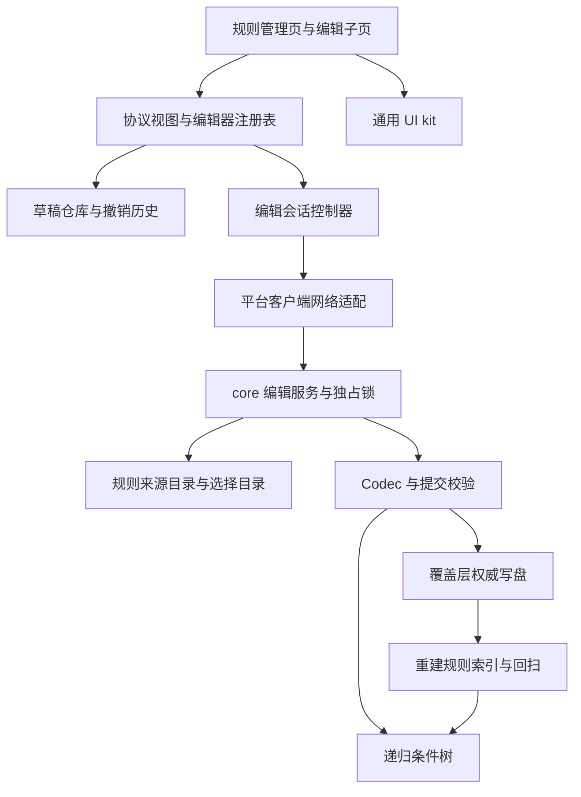

# 新前端与编辑后端重构计划

> 状态：grilling 共识已确认，待分阶段实施。
> 确认日期：2026-10-02。
> 环境：Minecraft 1.21.1，Fabric + NeoForge，Java 21，Mojang 官方映射。
> 本文件是实施计划，不表示其中的新模型、协议或界面已经存在。文中的新增类名是建议职责名称，实施时可按项目命名习惯调整。
> 用户已自行归档旧前端计划；本次只新增本文件。迁移决策以会话最后确认的范围为准。

## 1. 最终目的

退役当前占位前端，建立一套面向不熟悉 JSON 的单人玩家和服务器管理员的完整规则编辑器，接入并补齐 `core/**` 新后端。玩家通过图标选择、自然语言说明、条件逻辑树和参数表单完成规则管理，不需要为了使用内置能力而编写 JSON。

最终前端采用 Minecraft 原版容器与设置界面一类的灰色像素风格：像素边框、槽位、原版字体、按钮按压层次与少量状态色。布局和交互由自研 UI kit 实现，可以超出原版控件 API 的能力；避免现代网页式圆角卡片、大面积留白等表现。

完成后的端到端流程为：

```text
/idtw config edit
  → 服务端原子取得独占锁
  → 下发授权并打开规则管理页
  → 新建模板 / 浏览规则 / 自定义数据包规则
  → 独立编辑页与条件、效果子页面
  → 本地草稿与撤销 / 重做
  → 应用全部修改
  → 服务端校验、权威写盘、重建索引
  → 结构化回执与新快照
```

最终交付必须同时具备：

1. 浏览、新建、编辑、复制、停用、删除、恢复规则，覆盖全部 10 种内置条件和 12 种内置效果。
2. 真正可递归嵌套的 AND / OR / NOT 条件模型；规则级与效果级条件使用同一契约和编辑器。
3. 仅指令打开、服务端先授权的独占编辑会话，消除两个管理员同时打开 GUI 的竞态。
4. 多规则草稿统一应用，草稿跨界面关闭、断线和游戏重启保留，支持撤销 / 重做。
5. 原始数据包规则、自定义覆盖、停用与屏蔽状态可解释、可恢复；缺少第三方编辑器时保留原始数据。
6. 全新示例样本、真实 Debug 场景、两平台手动验收步骤与对应开发文档。
7. 完成新系统后再评估 `v1.2.1` 生成器的迁移价值，允许最终采用破坏性更新。

## 2. 已确认边界

| 项目 | 定案 |
|---|---|
| 用户对象 | 单人玩家和有编辑权限的服务器管理员；不新增普通无权限玩家的规则浏览入口 |
| 产品范围 | 完整规则管理器；全局性能配置管理、独立运行诊断控制台不属于本次 GUI |
| 后端范围 | 允许为条件树、名称、独占锁、快照、目录和编辑回执重构后端契约 |
| 规则作用域 | 保留实例 `config` 覆盖层；单人多个存档共享规则，多人编辑当前服务器的规则 |
| 主导航 | 规则列表进入独立规则编辑页；页内采用基本信息、源物品、触发条件、效果页签 |
| 创建入口 | 效果模板和空白规则；模板只提供初始规则，不进入持久化类型体系 |
| 条件界面 | 可展开、折叠的缩进树，具备按钮操作；拖拽是便利操作，不作为唯一操作途径 |
| 保存方式 | 编辑形成草稿，统一应用所有修改；完成子页编辑不等于服务器已应用 |
| 数据包规则 | 可查看、自定义覆盖、停用、恢复原始版本，不直接写数据包文件 |
| kit | 本项目维护带来源版本记录的副本，通用扩展记录后续回流；本次不先发布独立 UI 库 |
| 第三方类型 | 客户端编辑器 SPI；无编辑器时只读展示该节点并保留其原数据 |
| 名称 | 新增可选 `display_name`；自动生成稳定技术 ID，名称修改不改变 ID |
| 编辑互斥 | 一个编辑目标同时只允许一个管理员持有有效授权；模组修改命令同样检查锁 |
| 生命周期 | 内部页面切换和应用后保持锁，退出整个编辑器释放；断线、超时、停服清理 |
| 锁管理 | 增加查看占用者、强制结束会话的管理指令，失效会话不能继续提交 |
| 游戏暂停 | 普通单人世界沿用原版暂停习惯；多人或开放到 LAN 时不暂停 |
| 旧开发数据 | 不兼容旧 DNF 或其他中途开发格式；条件模型与样本可彻底重写 |
| 迁移来源 | 仅 `v1.2.1` 生成器的五类输出；是否实现迁移留到最终系统完成后评估 |

本次实现应保持已完成后端中未被明确调整的运行语义，例如来源层合并、单个掉落物只选一条规则、效果异常隔离、默认消耗以及效果调度预算。发现这些语义确实无法满足已确认目标时，单独说明影响并确认设计变更。

## 3. 查证基线与现有缺口

以下是本次源码核查时的事实，用于定位改动，不应当作新前端的既有实现。

| 当前事实 | 证据入口 | 对实施的影响 |
|---|---|---|
| 客户端为占位屏，两平台均保留快捷键打开 | `client/ui/screen/RuleEditorPlaceholderScreen.java`、两平台 `client/event/InputEvents.java` | 接入新屏后退役占位屏、按键、注册与失效资源 |
| 指令直接发送无字段的打开通知，快照请求才创建会话 | `core/command/RuleConfigCommands.java`、`core/network/transport/RuleEditServerHandler.java` | 必须把取得锁前移到服务端指令路径 |
| 会话按玩家保存，允许多人同时存在 | `core/service/EditSessionManager.java` | 改为目标级独占授权，不能只增加客户端锁定标记 |
| 条件仅支持二维 DNF，叶携带 `negated` | `core/model/ConditionExpression.java`、`ConditionGroup.java`、`RuleCodecs.java`、`CommonFields.java` | 更换模型、Codec、求值、校验和所有生成路径 |
| 同优先级按条件叶数量排序 | `core/model/Rule.java`、`core/runtime/RuleIndex.java` | 树按实际叶统计，不展开成 DNF 产生重复叶 |
| 快照跳过控制条目，缺少被覆盖、停用或屏蔽的原始基底 | `core/service/RuleSnapshotAssembler.java`、`core/load/RuleLoader.java` | 加载阶段保留完整来源目录，快照从目录装配 |
| 回执和快照问题主要是字符串 | `RuleSaveResultPayload.java`、`core/network/protocol/RuleSnapshot.java` | 增加状态码、操作关联、字段路径及本地化信息 |
| 覆盖规则写入实例 config | 两平台 `runtime/RuleRuntimeHost.java` | GUI 明示范围；草稿身份不能误称存档专属规则 |
| 当前内置样本为 6 个 JSON 文件、7 条规则，全部停用 | `common/src/main/resources/data/itemdespawntowhat/idtw/rules/` | 重写实际加载样本，不只修改说明中的 JSON |
| Debug 场景动态生成旧表达式 | `core/debug/DebugScenarioDefinition.java` | 与新 Codec 同阶段更新，保留既有场景验证意义 |
| 当前转换器面向开发期形状，拒绝 v1 扁平字段 | `core/command/RuleConvertService.java` | 不能当作 `v1.2.1` 迁移能力的证据 |

项目根目录以下路径中，`core/`、`client/` 简写均指 `common/src/main/java/com/meteorite/itemdespawntowhat/` 下的包。

相关现行后端地图：[后端开发者文档](../dev/backend/README.md)、[规则模型](../dev/backend/modules/rule-model.md)、[编辑协议](../dev/backend/modules/edit-protocol.md)、[类型系统](../dev/backend/modules/type-system.md)。这些文档记录当前实现；实施相应阶段后再更新为新契约。

### 3.1 kit 来源

来源目录：

```text
D:/system_default/desktop/mc_mod_project/unsuspiciousBlock-1.21.1-multi/
  common/src/main/java/com/meteorite/unsuspiciousblock/client/ui/kit/
```

核查时来源仓库 HEAD：`625747e1f34ea957841d7136be4635469687c227`；该 kit 目录未显示未提交修改。实际引入时重新记录所复制的 commit 与文件清单。

已有可复用底座包括 `UiDocument`、`UiNode`、`UiControl`、`UiControlGroup`、`UiLinearLayout`、`UiScrollView`、`UiFocusManager`、`UiNavigationHistory`、`UiTransform`、`UiNineSlice`、`UiControlStyle` 等。kit 不是完整表单库；现有输入适配、选择器和宿主浮层不能直接视为可独立复用的 kit 能力。

原版参考已经通过 IDEA 读取 1.21.1 vanilla merged jar 中的 `AllOfCondition`、`AnyOfCondition`、`CompositeLootItemCondition`、`InvertedLootItemCondition` 验证：组合条件可递归，AND / OR 保持子项顺序短路，NOT 包装一个子条件。借鉴结构与求值思路，不直接使用 `LootContext` 或移植原版全部战利品条件。原版 AND 空集合为真、OR 空集合为假，本项目将空组视为编辑不完整，禁止提交。参考：[Minecraft 官方 all_of / any_of 说明](https://www.minecraft.net/en-us/article/minecraft-snapshot-23w18a)。

## 4. 最终技术路线与职责划分



### 4.1 客户端分层

| 建议位置 / 职责 | 内容 | 依赖边界 |
|---|---|---|
| `client/ui/kit/**` | 几何、布局、裁剪、焦点、输入、通用列表、弹窗、像素主题能力 | 不知道规则、条件、效果、mod 常量或 loader API |
| `client/editor/view/**` | `RuleView`、`SourceView`、`ConditionNodeView`、`EffectView`，包装协议 JSON | 不解码为服务端 `core/model` 执行对象 |
| `client/editor/type/**` | 内置编辑器及第三方客户端编辑器 SPI | 通过类型 ID 关联服务端能力 |
| `client/editor/draft/**` | 基线、工作副本、脏状态、持久化、撤销命令、冲突比较 | 不访问世界，不通过 UI 控件直接发包 |
| `client/editor/session/**` | 授权、心跳、请求关联、应用状态、关闭与恢复流程 | 生命周期由控制器管理，不由单个 Screen 管理 |
| `client/ui/screen/**` 与宿主组件 | 页面、参数表单、注册表选择器、条件树业务节点 | 依赖 kit 和视图；业务概念不反向进入 kit |
| `fabric/client/**`、`neoforge/client/**` | 网络接收、客户端生命周期、线程切换 | 平台代码仅在平台模块 |

服务端不引用客户端类；`common/` 不 import Fabric 或 NeoForge 类。共享字段常量、协议 DTO 与纯值对象可以供两端引用。页面消费客户端视图，不绕过协议访问服务端运行时。

### 4.2 视图与原始 JSON

视图保留原始对象及已知字段的结构化访问，编辑修改对应路径，再生成 upsert 原始对象副本。不要用只包含已知参数的 DTO 重建整条规则，造成未知顶层字段或未安装编辑器的第三方节点丢失。

未知字段保留不等于放宽后端校验：现有类型内字段白名单仍生效。没有客户端编辑器但服务端认识的类型可作为只读节点保留；服务端也不认识的类型归入加载错误，不应显示成正常可运行规则。

## 5. 条件系统彻底重构

### 5.1 新模型与规范格式

采用不可变递归节点，建议 `ConditionNode` 为 sealed 接口，包含 `AllOf`、`AnyOf`、`Inverted`、`Leaf`。`ConditionExpression` 表示可选根节点；无根表示无附加限制。规则与效果用相同 Codec。

规范 JSON 使用组合层与具体条件分离的形状：

```json
{
  "conditions": {
    "op": "all_of",
    "terms": [
      {
        "op": "leaf",
        "condition": {
          "type": "itemdespawntowhat:dimension",
          "dimensions": ["minecraft:overworld"]
        }
      },
      {
        "op": "any_of",
        "terms": [
          {
            "op": "leaf",
            "condition": {
              "type": "itemdespawntowhat:weather",
              "weather": "rain"
            }
          },
          {
            "op": "inverted",
            "term": {
              "op": "leaf",
              "condition": { "type": "itemdespawntowhat:outdoor" }
            }
          }
        ]
      }
    ]
  }
}
```

约束：

- `all_of` / `any_of` 的 `terms` 至少一项，允许嵌套。
- `inverted` 恰好有一个 `term`。叶或组取反都使用此节点。
- `leaf.condition` 继续采用 `type` + 类型参数平铺的分发；组合字段不塞进具体类型 Codec。
- 无条件时省略 `conditions`；不再接受旧二维数组、`groups` 对象或叶级 `negated`。
- 退役 `ConditionGroup`、`Condition.negated()`、`CommonFields.negated()` 及旧 DNF 专用遍历，重写所有内置叶 Codec。
- 注册顺序保留为条件类型 → 表达式 Codec → 效果类型。第三方服务端 API 以新表达式为准，不承诺中途开发版二进制兼容。
- 读取错误明确说明旧格式不支持，并定位字段；不静默改写旧文件，不自动删除用户规则。

本节确定规范字段和结构；P0 建立契约清单，P2 的模型、样本、协议视图与后续编辑器必须使用同一形状。

### 5.2 求值与异常

保留有序短路；不将树展开成 DNF，也不根据树形布局自动改变子项顺序。

求值结果必须区别正常真、正常假、不可求值和执行异常。建议结果为 `MATCH`、`NO_MATCH`、`UNAVAILABLE`、`ERROR`，由框架识别未加载范围、未注册类型和异常；纯谓词条件求值器与可求值性检查均不得修改世界。

具体接口路线：保留条件求值器的布尔纯谓词职责，在条件类型契约增加默认就绪的可求值性检查；框架先检查是否可求值，再调用谓词并包装结果。范围未加载返回 UNAVAILABLE，检查或谓词抛出异常返回 ERROR。这样可表达安全失败，又不需要每个普通条件实现重复的异常包装逻辑。

| 运算 | 规则 |
|---|---|
| NOT | 只互换 MATCH / NO_MATCH，保留 UNAVAILABLE / ERROR |
| AND | 遇 NO_MATCH 可短路；遇 UNAVAILABLE 记录并继续，其他子项能明确判否则返回 NO_MATCH，否则返回 UNAVAILABLE；实际遇 ERROR 则返回 ERROR |
| OR | 遇 MATCH 可短路；遇 UNAVAILABLE 记录并继续，其他子项能明确判真则返回 MATCH，否则返回 UNAVAILABLE；实际遇 ERROR 则返回 ERROR |
| 表达式根 | 仅 MATCH 允许通过；无条件根按 MATCH 处理 |

短路未执行的分支不额外求值以收集错误。异常记录原始日志，GUI 接收可定位信息。规则级不可求值按未命中进入既有重试路径；效果级不可求值跳过该效果，继续后续效果。`NOT(UNAVAILABLE)` 或 `NOT(ERROR)` 绝不通过。

原 `surrounding_blocks` 的未加载区块门禁必须迁移到新的可求值性检查。单纯“标签当前没有成员”是否匹配仍遵循类型本身语义，不把标签 WARN 一律升级为提交错误。

### 5.3 校验、统计与初始限额

统一树遍历器用于叶数量、节点数量、深度、类型参数和动态引用检查，避免各模块分别实现递归。根深度定义为 1。

| 限额 | 工程初值 |
|---|---|
| 每个表达式叶数量 | 128，规则级与每个效果级分别计算 |
| 每个表达式节点数量 | 256，包含组合与取反节点 |
| 表达式深度 | 16 |
| 每规则效果数量 | 32 |
| source 匹配与排除项合计 | 256 |
| 显示名称 | 128 个 Unicode code point，空白名称视为未命名 |

前端允许不完整草稿，但禁止应用。所有入口在递归 Codec / 求值前检查资源边界，超限返回具体字段路径，不以栈溢出作为拒绝方式。保留 `TypeDispatch` 对具体类型 Codec `keys()` 的严格检查。

同优先级的复杂度仍是实际条件叶数，组合与 NOT 节点不增加复杂度；定义序兜底由服务端提供稳定序号。显示列表的排序或效果拖拽不得偷偷修改规则优先级。

## 6. 独占编辑锁与时序

### 6.1 服务端权威

锁作用于实际编辑目标，不能按玩家各建一把锁。建议新增或重构目标级编辑服务，保存 `owner UUID`、不可预测 `sessionId`、目标标识、授权状态、最后活动时间及当前保存操作。

```text
FREE
  → OPENING：检查权限与能力，原子取得锁，发送授权
  → ACTIVE：收到打开确认，允许快照、目录、心跳与提交
  → APPLYING：同一会话串行处理一次应用
  → ACTIVE：回执及快照已处理，可继续编辑
  → FREE：主动退出 / 断线 / 租约到期 / 强制结束 / 停服
```

核心顺序：

1. `/idtw config edit` 在服务端检查玩家身份、权限、运行时就绪与客户端编辑通道。
2. 同一权威串行路径中完成检查和 `tryAcquire`。两人同时申请只能一个成功。
3. 取得锁之后才发送包含 `sessionId`、目标和协议版本的打开授权。
4. 客户端仅接受本次连接内有效授权，安装控制器并确认打开，再请求完整快照。
5. 快照请求不能创建锁、续建一个无授权的新会话或直接触发 GUI。

可用服务端主线程串行处理现有两平台入站路径；若引入异步工作，只处理不访问世界的任务，并在回到权威线程后重验授权、目标和版本。锁检查与取得不能分成两段异步操作。

### 6.2 会话保护

- 所有修改、读取编辑目录、分片、心跳和释放包核对发送者与 `sessionId`；操作关联使用独立 `requestId` / `operationId`。
- 关闭旧页面产生的延迟释放、迟到的打开通知、上一连接的包，不能影响新会话。
- 同一玩家重复执行打开指令，不创建第二个有效会话；已有会话有效则反馈现状或恢复同一控制器。
- 内部 Screen 切换不释放锁。导航由编辑宿主控制，不能在每个 Screen 的 `removed()` 中无条件释放。
- 根页面退出先完成本地草稿落盘，再释放授权。断线立即停止发送，但保留草稿。
- 授权被强制终止后界面停止编辑提交，提示通过指令重新取得权限；不得在后台自动重新抢锁。
- 保存中的释放或强制终止需等待该操作获得确定终态，或安全取消尚未开始的操作；旧操作可能写盘时不得向第二人授予可提交的新锁。
- 服务端停止清空授权和分片。权限降低也应终止会话或至少在每次敏感请求时拒绝。

### 6.3 心跳、暂停与管理指令

工程初值：打开确认窗口 15 个服务端活动秒；心跳间隔 10 秒；有效会话租约 60 个服务端活动秒。具体常量集中定义，P3 通过两平台实机验证后允许有据调整。

暂停处理使用服务端活动时钟或等价的暂停感知时钟，不能在单人暂停期间仅按墙钟判定失联。低 TPS 下分别显示等待和授权状态，不把网络等待当作锁已释放。恢复运行、断线与正常退出仍可清理。

普通单人保持原版 Screen 暂停行为；开放 LAN 或多人时由原版机制继续运行。服务端不得为暂停检测引用 `Minecraft` 或其它客户端类。

已通过 IDEA 核对 1.21.1 的共享 `MinecraftServer.isPaused()`、`getTickCount()` 与任务处理循环，以及 `IntegratedServer` 的暂停分支。实现可经共享服务器接口识别暂停；不要 import `IntegratedServer`。编辑请求在暂停期间仍需经服务端执行器处理，不能放入只随世界 tick 推进的业务队列，造成暂停后无法获取快照或保存。P3 同时验收“已暂停但仍能读写编辑数据”和“暂停不推进租约”。

管理指令建议为 `/idtw config edit-lock status`、`/idtw config edit-lock release`，使用明确的管理权限检查与操作者反馈。强制结束使旧 token 立即失效；新的管理员仍走指令申请流程。

本模组的规则变更、重载与最终可能保留的转换命令都经同一锁闸门。只读 list / validate 可用。持锁者外的操作者和控制台不能绕过会话闸门执行变更；需要时先显式结束会话。原版 `/reload` 和外部文件编辑仍由版本及上下文校验处理。

## 7. 编辑协议、来源目录与选择数据

### 7.1 协议升级

引入显式编辑协议版本，旧开发版客户端与服务端不做混用兼容。平台只负责注册、传输与线程切换，服务端共用处理服务；客户端回调只在客户端安装。

| 交互 | 最少数据 |
|---|---|
| 打开授权与确认 | 协议版本、sessionId、targetId、目标范围、上下文修订 |
| 心跳、关闭、失效 | sessionId、原因码；关闭幂等 |
| 请求 / 接收快照 | sessionId、requestId、规则版本、上下文修订、完整性标识 |
| 请求选择目录 | sessionId、requestId、目录类型、筛选、分页与目录修订 |
| 提交变更集 | sessionId、operationId、目标、expectedVersion、上下文修订、逐 ID 修改 |
| 应用回执 | operationId、状态码、是否已落盘、是否已生效、结果版本、完整问题列表 |

回执至少区分：成功、无修改、无权限、锁不属于当前会话、会话失效、版本冲突、校验失败、写盘失败、已写盘但重载失败、请求不合法、传输或运行时不可用。

问题 DTO 至少包含 severity、ruleId（可空）、origin、fieldPath、messageCode、messageArgs，以及供第三方或未知错误使用的 fallbackMessage。内置消息同步提供 `en_us.json` / `zh_cn.json`；客户端不解析中文日志或 `|` 拼接文本来决定状态。保留每个字段的问题，并支持跳转到对应页签、节点和输入。

校验仍由服务器最终裁定。前端实时检查结构、必填和数值范围；需要服务器动态目录的问题在应用前后准确展示，不用本地猜测覆盖权威结论。

### 7.2 完整来源目录

加载服务应保留按 ID 聚合的来源目录，包括原始基底、原始覆盖、控制条目、加载问题和最终生效状态，避免仅由合并后的运行索引反推。

目录至少区分：数据包原始、自定义覆盖、自建、普通规则停用、基底停用、基底屏蔽、原始条目非法以及基底缺失。保留原始 JSON、结构化来源、服务端排序序号；不可解析或没有可用 ID 的文件以问题列表呈现，不制造可编辑假规则。

| GUI 操作 | 覆盖层语义 |
|---|---|
| 新建 / 复制 | 新 ID 完整规则 UPSERT |
| 自定义数据包规则 | 相同 ID 写入完整覆盖规则 |
| 停用普通自建 / 覆盖规则 | 保存 `enabled=false`，保留内容 |
| 停用原始基底 | 保存仅含 id 和 `disabled=true` 的控制条目 |
| 屏蔽原始基底 | 保存仅含 id 和 `delete=true` 的控制条目，仍在管理视图可恢复 |
| 恢复原始版本 | 移除该 ID 的覆盖 / 控制条目，重新显示当前基底 |
| 删除自建规则 | 删除覆盖层条目；若发现同 ID 基底，改用准确的恢复 / 屏蔽操作说明 |

协议 DELETE 表示删除覆盖条目；JSON `delete=true` 表示屏蔽基底，两者不可混称为同一个删除行为。快照要展示控制状态，解决现状下停用 / 屏蔽后无法恢复的问题。

同 ID 多文件重复定义、路径冲突或坏 JSON 时，保留数据并阻止有歧义的修改，提供来源定位。无需为实现完整管理器而在 GUI 新增原始 JSON 修复工具。

### 7.3 选择目录

物品、方块、实体、流体、状态效果、群系、维度、战利品表与对应标签由目录适配器供给。可利用客户端已同步的注册表渲染图标与名称，但服务端的类型能力、已加载维度和有效战利品表是权威来源。

目录带修订号，在 reload 后失效并重查。大型目录分页或按需查询标签成员，不在每帧扫描完整注册表。搜索支持本地化名称、技术 ID、命名空间；模组名称未知时显示命名空间。

失效引用保留原输入并展示诊断；没有图标的项目采用通用像素图标与 ID。标签预览显示数量、成员和当前用途语义：来源匹配任一成员，产出标签按实际类型可能随机选一项。战利品表不提供错误的标签选项。

### 7.4 传输边界

保留按 UTF-8 字节计算的直发与分片保护。工程初值沿用 C2S 直发 32,000 B、分片 30,000 B、变更集 4 MiB；不把字符数当字节数。

完整规则快照采用可分片传输，工程初始总量上限 4 MiB；单片留足 S2C 载荷开销。选择目录采用分页，避免把全目录塞进快照。限制在途请求、总内存与超时时间，拒绝跨 session 混片，重复下标以首片为准。

仅在全部分片、版本和目标一致时安装快照。超量或中断明确显示失败，不能截断后仍允许基于不完整数据应用。新限额是工程初值，P0 / P3 记录实际负载和平台约束后核定。

## 8. 草稿、撤销与保存恢复

### 8.1 工作区与身份

每个编辑工作区保留原始基线、工作副本、规则版本、上下文修订、逐规则修改和历史命令。技术 ID 新建时自动生成并避免冲突；复制分配新 ID，自定义基底沿用原 ID。已持久化 ID 是身份信息，不随显示名称变化。

服务端提供可持久识别的 `targetId`，以覆盖层为目标保存身份；客户端还记录连接来源和玩家身份。不要仅凭地址、存档名称或服务器 MOTD 判定草稿归属。单人不同存档可共享覆盖规则，但数据包上下文不同，恢复时必须复核。

草稿文件放客户端专用目录，例如 `config/itemdespawntowhat/client/editor-drafts/`，不得放入覆盖层 `rules/`。包含独立草稿格式版本、基线与工作 JSON、待删除 / 恢复动作和目标信息，不持久化 session token。

采用防抖与原子替换保存；根页面关闭和客户端正常退出刷新待写数据。坏草稿保留备份并报告，不能因读取失败覆盖为一份空草稿。重启恢复至少保留全部未应用改动；撤销历史可以只在当前编辑工作区内保留。

### 8.2 撤销 / 重做

使用编辑命令或按规则的前后值记录，不复制整个注册表或完整来源目录。覆盖字段编辑、源列表、条件节点参数和结构、效果增删 / 移动、规则增删 / 停用 / 恢复。

一次连续文本输入合并为一次用户操作；拖拽或移动完成后记一条命令。新操作清除 redo，子页面切换不清除历史。提供可见按钮和快捷键；文本输入焦点中的快捷键按文本编辑优先处理。

工程初值：最多 100 条操作并设置内存预算，淘汰最旧历史不丢弃当前草稿。应用成功更新基线并结束本轮历史，撤销不自动回滚已经生效的服务器操作。

### 8.3 应用流程

```text
EDITING → 本地校验 → SENDING / APPLYING
    ├─ 拒绝：保留草稿，定位问题或重新核对基线
    ├─ 成功 + 完整新快照：更新基线，清除本次已确认修改
    ├─ 已落盘但重载失败：标记已保存未生效，保留操作记录并重新查询
    └─ 回执超时：状态未知，查询操作结果 / 权威快照，禁止盲目重发
```

一次只有一个在途应用。发送期间冻结本次修改或清楚分离新的编辑，不能用迟到回执清掉后来新增的草稿。只有与当前操作关联的完整结果才能更新相应基线。

服务端保留有限的 operationId 结果或等价幂等机制，处理重复提交及回执丢失。结果缓存与会话目标关联；缓存过期时以重新读取的权威状态核对，不推测上一次是否成功。

写盘继续按 ID 基于磁盘原始内容应用，保留未编辑条目、备份、原子替换和失败回滚机制。校验整批完成后才落盘。重载失败是已写入与运行索引不同步的独立状态，不冒充完整成功或“完全没保存”。

### 8.4 外部冲突与恢复

独占锁不替代版本戳和磁盘修订核对。原版 reload、手工文件编辑或换存档可使工作区过期。

比较基线 B、本地草稿 L 和最新服务器 R：

- 只有服务器改变：采用 R。
- 只有本地改变：将草稿保留到 R 的新基线上。
- 双方结果一致：无需再次覆盖。
- 同一规则双方不同：展示整条规则的名称、来源、摘要和差异，由用户选择版本。
- 对删除、恢复、控制状态也做比较；不能只比较生效规则 JSON。

不自动按字段合并条件树或效果数组。选定本地版后仍需重新校验，并再次明确应用；不因恢复草稿自动提交。锁失效时先退出有效编辑状态，再通过指令重新取得授权。

## 9. 页面、控件与完整能力

### 9.1 页面结构

| 页面 | 主要内容 |
|---|---|
| 规则管理页 | 搜索、来源 / 状态 / 效果筛选、规则摘要、草稿标记、新建 / 复制 / 停用 / 删除 / 恢复、应用全部修改 |
| 模板选择页 | 明确的效果入口及空白规则；选模板创建工作草稿 |
| 规则编辑页 | 基本信息、源物品、触发条件、效果页签；持续显示名称、摘要与草稿状态 |
| 条件编辑页 | 缩进树、折叠、添加叶 / 组、取反、复制、删除、移动及参数编辑 |
| 效果参数页 | 类型专属表单、概率、延迟、效果附加条件摘要与入口 |
| 通用选择器 | 搜索、可用图标、名称、模组 / 命名空间、多选、标签成员预览、可手输技术 ID |
| 冲突 / 保存反馈 | 整条规则比较、字段问题定位、操作终态和可执行恢复动作 |

来源选择提供从背包 / 手持物品选取。返回上一级保留搜索、筛选、选中项、滚动位置和未完成输入；子页面“完成编辑 / 返回”仅更新草稿。需要保存的退出路径明确区分应用、保留草稿退出和放弃草稿。

基础信息至少覆盖 `display_name`、enabled、notes、trigger_after_seconds，priority 放高级信息。高级字段已设置时即使折叠也显示摘要。名称显示原文字串，不把玩家自定义名称当本地化 key。

### 9.2 内置条件表单

| 条件 | 编辑能力 |
|---|---|
| dimension | 维度多选 |
| biome | 精准群系 / 标签选择，以及气候模式下六参数区间 |
| weather | 晴朗、下雨、雷暴；解释下雨与雷暴的实际区别 |
| outdoor | 露天判定，取反由树节点表达 |
| surrounding_blocks | 六向位置示意和方块 / 标签选择，至少填一向 |
| catalyst_present | 物品 / 标签列表与数量；明确这是在场判定，不是消耗 |
| fluid_present | 流体 / 标签 / 任意流体，源流体要求 |
| time_of_day | 时段选择与精确值，支持跨午夜区间，不误当持续秒数 |
| y_level | 高度上下界与不限端 |
| light_level | 亮度上下界与不限端 |

### 9.3 内置效果表单

| 效果 | 编辑能力 |
|---|---|
| spawn_item | 物品 / 标签、数量、邻域上限和半径 |
| spawn_entity | 实体 / 标签、数量、年龄、邻域上限和半径 |
| place_block | 方块 / 标签或使用源方块、形状、数量、半径与上限 |
| spawn_xp | 经验量与按覆盖源物品倍率 |
| loot_table | 服务端有效战利品表与幸运值 |
| lightning | 闪电数量 |
| explosion | 强度、引火、仅视觉效果 |
| arrow_rain | 箭数、拾取策略、药水效果列表、持续时间与等级 |
| weather | 雨 / 晴、雷暴选项、持续时间 |
| consume_source | 源物品数量 |
| consume_catalyst | 物品 / 标签列表、数量、半径 |
| consume_fluid | 流体 / 标签 / 任意、源流体要求 |

每种效果均可编辑概率、相对触发延迟和附加条件。同一消耗类型在一条规则中只能出现一次；选择器提示禁用重复选项，服务器仍校验。

消耗摘要解释三种行为：没有任何显式消耗时默认消耗源物品；显式源消耗决定每轮数量；仅声明催化剂 / 流体消耗时取消默认源消耗并影响轮数。添加效果时不能静默补入或删除另一个消耗效果来改变语义。

效果列表展示的是声明 / 启动顺序，不承诺前一个完成后再启动后一个。延迟分别从规则触发时刻计时；附加条件和概率在实际执行时判定，效果不是事务，失败不回滚已完成动作。世界现象与产出效果的倍率区别由对应帮助说明表达。

### 9.4 kit 扩展边界与视觉验收

通用组件优先包括输入适配、数值 / 区间输入、切换与下拉、虚拟滚动列表、通用树列表、弹窗、tooltip、焦点与导航。规则树节点的字段和语义、注册表访问、模板、草稿不进入 kit。

可以封装原版 EditBox 等已有能力，不要求为了超出原版限制而重写所有基础控件。宿主统一转发键盘、鼠标、滚动、焦点和裁剪；不照搬隔壁项目的业务 `OverlayLayer`。嵌套选择和参数页使用页面导航或明确的弹窗栈，避免仅支持一个浮层导致关闭错对象。

以 GUI 逻辑像素为布局单位，最低验收尺寸初值为 320×240；小尺寸页签可滚动、参数转单列，树节点缩进不无限侵占正文。大屏可扩宽，但不拉出大量空白。低于最低尺寸给出明确提示，核心退出操作仍可达。

同时验收窗口缩放、原版可选 GUI 缩放、中英文长文本、Tab / Shift+Tab、Enter / Esc、滚轮、错误定位、禁用状态、tooltip 不越界。颜色必须辅以文字或图标，不以颜色作为唯一状态提示。

## 10. 第三方客户端编辑器与 kit 回流

建议新增 `ClientConditionEditorDefinition`、`ClientEffectEditorDefinition` 及注册表 / provider。定义类型 ID、名称与帮助 key、默认草稿工厂、字段所有权、参数编辑器、摘要和本地校验。客户端只显示服务端当前已注册的可创建类型，避免本地有编辑器但服务器没有执行能力。

注册表在客户端初始化完成后冻结，重复 ID 明确报错。默认实现覆盖全部内置类型；第三方可以提供专用组件，不需要服务器发送任意可执行 UI 代码。

未知客户端节点显示类型 ID、只读摘要和“缺少编辑器”的说明；允许在显式操作下删除整个节点，其他编辑必须原样保留其 JSON。不得将缺少编辑器视为节点内容为空，也不得自动移除。

kit 引入时记录来源 commit、文件清单、包名重定位及兼容修改；维护通用扩展清单和宿主依赖检查。独立库发布是后续任务，本次不建立对隔壁源码绝对路径的 Gradle 依赖，也不修改隔壁项目。

## 11. 分阶段实施计划

各阶段内部按以下任务拆成可独立构建与验收的小任务。实际阶段进度在完成后记录，不提前把待做事项标为已完成。

### P0：冻结契约与验收基线

- 写明新树 JSON、无条件表达、节点与限额；确认求值结果和树统计。
- 列出目标身份、session / operation / revision 字段和编辑状态机。
- 画页面结构、最小尺寸布局和主要用户操作路径。
- 核对用户当时未提交改动，选定实施基线，不覆盖其代码。
- 建立样本覆盖表、锁竞态矩阵、保存异常矩阵与阶段检查清单。

产物：实施可直接使用的契约说明与原型约定。P0 不启动大规模实现；若发现无法满足共识的约束，明确记录影响。

主要文件范围：本计划的执行记录、未来条件树 / 编辑会话 ADR、客户端页面与协议契约说明。

### P1：kit 引入、组件与界面原型

依赖：P0。

1. 引入并重定位 kit，记录来源，保持独立依赖边界。
2. 增加灰色像素主题、输入 / 列表 / 树 / 弹窗等通用能力与宿主适配。
3. 制作规则管理、页签编辑、缩进条件树和选择器原型，用开发样本确认可操作性。

原型仅作为开发设施；任何可运行的编辑 GUI 入口也必须经过指令授权，不留下按键或无锁打开路径。P3 尚未完成时，原型不得接入生产编辑入口。

主要文件范围：`common/.../client/ui/kit/**`、客户端主题与宿主组件、原型页面、kit 来源及扩展记录。P1 先完成组件和布局；需要实机打开整套原型时，在 P3 授权链路接通后使用同一指令入口验收，不另建绕过锁的开发快捷入口。

验收：布局、滚动、裁剪、焦点、长文本和最小尺寸可用；业务类型没有侵入 kit。

### P2：新条件系统与展示元数据

依赖：P0；实现可以在 P1 原型定型后推进。

1. 替换 `ConditionExpression` / `ConditionGroup` 和叶取反契约，完成递归 Codec、树遍历与限额。
2. 重写 `ExpressionEvaluator`，迁移可求值性门禁；更新 `RuleValidation`、`RuleReferenceValidator`、`Rule.complexity()` 与相关调用。
3. 更新全部内置条件、效果的表达式参数、注册装配和第三方服务端接口说明。
4. 在 `RuleFields`、`Rule`、`RuleCodecs` 增加 `display_name`。
5. 同步更新受新 Codec 影响的 6 个内置样本文件和 Debug 生成器，保证本阶段不留生产目录中的旧格式；P7 再完成扩充样本矩阵。
6. 暂停暴露当前错误基线的转换功能；P8 再按 v1.2.1 重新实现或退役。不要在本阶段为中间开发数据建立新转换支线。

主要文件范围：`core/api/RuleFields.java`、`core/model/{Condition,ConditionExpression,ConditionGroup,ConditionType,CommonFields,Rule,RuleCodecs,RuleValidation}.java`、`core/runtime/{ExpressionEvaluator,RuleIndex}.java`、`core/service/{RuleReferenceValidator,BuiltinTypeRegistries}.java`、`core/type/condition/**`、`core/type/effect/**`、`core/extension/RuleTypeProvider.java`、`core/debug/DebugScenarioDefinition.java`、内置规则目录及转换命令入口。新增树节点和求值结果类型按上述职责定位。

验收：新树加载、嵌套取反、无条件、错误路径和排序正确；旧格式明确拒绝；真实加载与 Debug 链路可运行。不会因为 NOT 把未加载或异常变成通过。

### P3：独占会话与协议

依赖：P0、P2。

1. 重构 `EditSessionManager` / 编辑服务，实现原子获取、授权、确认、心跳、关闭和强制终止。
2. 改造指令路径、两平台 registrar、生命周期、命令锁闸门；冻结协议版本与 DTO。
3. 增加结构化回执、操作关联、分片授权检查、幂等结果与超时恢复查询。
4. 验证单人暂停 / LAN 与多人行为；移除生产路径上绕过授权的直接打开入口。

主要文件范围：`core/service/EditSessionManager.java`、新的编辑会话服务、`core/command/{RuleConfigCommands,RuleCommandContext}.java`、`core/network/protocol/**`、`core/network/transport/**`、两平台 `network/registrar/RuleEditPayloadRegistrar.java`、Fabric 客户端网络注册、两平台运行时生命周期和客户端初始化。先核对具体 registrar 路径，平台专属回调不得进入 common。

验收：同时申请只有一人获准；旧释放包不误解锁；伪造快照请求不能建会话；保存、重连、强制解锁和暂停均符合状态机。

### P4：来源目录、选择目录与客户端工作区

依赖：P2、P3。

1. 在加载 / 装配层保留来源目录，升级快照，展示控制状态与原始基底。
2. 提供服务端目录、分页、标签成员与修订失效；完成快照分片。
3. 建立客户端协议视图、类型编辑器注册表、控制器和内存草稿工作区。
4. 实现逐 ID 操作与原始 JSON 保留，区分删除覆盖、停用和恢复。

主要文件范围：`core/load/{RuleLoader,RuleLoadResult,RawRuleEntry,DatapackRuleReader,OverlayRuleReader}.java`、`core/service/{RuleLoadingService,RuleSnapshotAssembler}.java`、新增来源 / 选择目录服务、协议 DTO 和 `client/editor/{view,type,session,draft}/**`。原始来源目录保持加载层与模型层单向依赖，在 service 装配，不让 core/load import core/model。

验收：停用 / 屏蔽后仍可找到并恢复；第三方原数据不丢失；目录来自当前服务器；不完整快照不能进入可提交状态。

### P5：完整编辑器

依赖：P1、P4。

1. 接入管理页、搜索筛选、模板、规则页签和来源多选。
2. 接入条件树与全部 10 种内置条件参数表单。
3. 接入有序效果列表与全部 12 种效果表单、附加条件和消耗摘要。
4. 完成第三方只读回退、自然语言摘要、错误定位和双语文本。

主要文件范围：`client/ui/screen/**`、宿主业务组件、`client/editor/type/**`、选择器与摘要适配、`assets/itemdespawntowhat/lang/{en_us,zh_cn}.json`。新增 GUI 入口只接服务端授权控制器。

验收：玩家可仅通过 GUI 构造全部内置能力；页内完成仅形成草稿；大缩放和长文本下核心操作可达。

### P6：持久草稿、撤销与应用恢复

依赖：P4、P5。

1. 持久化草稿、目标身份、版本与工作副本，完成异常文件保护。
2. 覆盖所有编辑操作的 undo / redo，并处理文本输入的快捷键优先级。
3. 统一应用、在途冻结、成功快照安装、幂等查询和已保存未生效状态。
4. 完成外部变更的整条规则比较，以及重新授权后的恢复流程。

主要文件范围：`client/editor/draft/**`、`client/editor/session/**`、冲突 / 保存反馈页面、应用请求与结果查询服务。服务器保存仍复用 `RuleSubmissionValidator`、`RuleOverlayWriter` 和运行时重建入口，不从控件直接写文件。

验收：关闭、断线、重启不丢草稿；不同目标不混用；回执丢失不重复提交；迟到结果不清除新修改；冲突不会静默覆盖。

### P7：样本、两平台验收与退役收尾

依赖：P2～P6。

1. 完成全新内置样本与 Debug / 开发案例覆盖表。
2. 在 Fabric 与 NeoForge 分别执行用户手动验收，并记录已通过及未通过场景。
3. 退役占位屏、打开快捷键、旧按键注册 / 事件与废弃语言 key；保留新指令网络初始化。
4. 更新开发文档、领域词汇和架构决策；对被替代的决策记录标注历史状态，不重写历史结论。
5. 记录 kit 通用扩展的回流清单，以及独立发布尚未完成的内容。

主要文件范围：内置规则目录、`core/debug/**`、Debug 验证说明、`RuleEditorPlaceholderScreen.java`、`client/key/ModKeyBindings.java`、两平台 `client/event/InputEvents.java` 和客户端注册、两份语言文件、第 14 节列出的开发文档。

验收：生产 GUI 只有授权指令入口；两平台全部核心流程可用；样本、文档与运行契约一致。

### P8：仅针对 v1.2.1 的迁移评估

依赖：最终模型和运行语义已经确定，原则上在 P7 功能验收完成后执行。

先完成第 13 节决策门槛，再选择实现转换或退役转换功能。此阶段不为中间开发格式添加兼容，不要求为了迁移而回退已经确定的新设计。

主要文件范围：只读 `v1.2.1` tag 的生成器与配置定义；最终选择保留时重写 `core/command/RuleConvertService.java` 及命令接入、代表样本和迁移说明，否则删除失效转换入口、实现与相关文本。

验收：明确选择及依据；若保留转换，则输出仅为新格式且纳入锁、校验和备份流程；若采用破坏性更新，则没有残留的错误转换入口或兼容承诺。

## 12. 样本与手动验收矩阵

### 12.1 示例样本重写

当前内置目录是实际数据包。重写后的内置样本加入可读 `display_name`、简洁 notes，全部默认 `enabled=false`；不要为了演示而默认触发爆炸、天气或其它世界变化。

每份样本说明来源、条件、产出、消耗、触发与如何观察结果，使用与最终格式一致的真实规则。至少覆盖：

| 维度 | 必须覆盖 |
|---|---|
| 内置条件 | 10 种全部，biome 两模式、跨午夜时间和六向方块配置 |
| 内置效果 | 12 种全部，药水列表、源方块、战利品表等复杂参数 |
| 逻辑树 | AND、OR、叶 / 整组 NOT、真正嵌套 `A AND (B OR NOT(C AND D))` |
| 条件作用域 | 规则级与效果级；无条件字段省略 |
| 执行 | 效果顺序、独立延迟、概率、产出倍率与世界现象区别 |
| 消耗 | 默认源消耗、显式源消耗、仅催化剂 / 流体消耗、同类型重复拒绝 |
| 来源 | 单物品、标签、排除、数据包自定义覆盖、停用、屏蔽与恢复 |
| 边界 | 空组合、错误 NOT、旧 DNF、超深 / 超多节点、失效引用 |
| 安全失败 | 未加载区块、异常在 NOT 下仍不通过，未知编辑器原数据保留 |

非法案例只放开发专用资源或 Debug 场景，不放正常内置规则加载目录。保持既有 `convert/retry/delay/expiry/stack/priority/excluded/reload` 功能场景及压力场景的原目的，新树专项另列，避免改变负载后误作性能对照。

### 12.2 双平台关键场景

| 场景 | 验收结果 |
|---|---|
| 两管理员同时执行打开指令 | 一人获准，一人得到占用提示；服务端没有两份有效会话 |
| 未授权直接请求快照或提交 | 拒绝，不创建会话、不打开 GUI、不落盘 |
| 旧会话 close / heartbeat / save 迟到 | 不影响后来授权，不释放新锁、不提交旧修改 |
| 子页导航、应用后继续编辑 | 保持同一有效锁 |
| 断线、关闭、失联、停服、强制终止 | 按对应路径回收；本地草稿保留 |
| 单人长时间暂停后恢复 | 不误超时，退出可正常释放；开放 LAN 不暂停 |
| 保存中断线或强制终止 | 不允许另一会话与未结束写盘重叠，终态可核对 |
| 其他管理员 / 控制台执行修改命令 | 持锁期间受到闸门约束；查询仍可用 |
| 基底停用 / 屏蔽 / 自定义后恢复 | 管理页能找到状态，恢复当前基底，不误删数据包 |
| 手工改文件、原版 reload、换存档 | 发现版本 / 上下文改变，保留并比较草稿 |
| 保存失败、重载失败、回执丢失 | 展示正确终态；不把未确认结果当失败盲目重发 |
| 分片中断、重复、跨会话、超量 | 不安装残缺快照，不执行残缺变更集 |
| 多语言、大 GUI 缩放、320×240 | 文本、滚动、焦点与操作区可用，无唯一不可达操作 |

### 12.3 项目验证规则

实现代码阶段按项目要求先用 IDEA MCP 检查 git 工作区报错 / 警告，忽略 Markdown 格式问题，再执行 `./gradlew build`。Windows 可使用等价的 `gradlew.bat build`。

新增 Java 类补充中文类注释，方法注释用中文 `//`；坚持平台与端隔离，优先使用已有 Event API。本路线没有新增 Mixin 的前置要求。实施中 API 不确定时先使用项目上下文，再按 AGENTS 的 Level 2 查询源码；只有 Level 2 无法解决且需要 Level 3 操作时，说明原因并取得用户确认。

Gradle 构建等待窗口至少 120 秒；工具返回运行中任务 ID 时持续等待至结束，不在上一构建状态未知时重复启动。构建或 IDEA 检查失败先修复再验证；原因不明确或需要改变设计时说明后再继续。

游戏测试由用户执行，不新增 test 文件。仅 JSON 改动只校验 JSON 合法性；仅 Markdown 改动无需格式校验。本次计划文件落盘属于 Markdown 文档交付，不启动构建，也不声称代码或实机流程已验证。

## 13. 迁移门槛：只看 v1.2.1 生成器

### 13.1 唯一基线

本地 tag 为 `v1.2.1`，commit：`5a85911b68fc84e809d13099ab32a711d6437076`。

该生成器保存五类顶层对象数组文件：

```text
item_to_item.json
item_to_mob.json
item_to_block.json
item_to_xp_orb.json
item_to_world_effect.json
```

证据为该 tag 的 `config/ConfigType.java`、`config/handler/BaseConfigHandler.java`、`config/conversion/BaseConversionConfig.java` 和各具体配置。基础字段包括 `item/result/source_multiple/result_multiple/conversion_time/need_outdoor/dimension/surrounding_blocks/catalyst_items/inner_fluid`；世界现象在统一文件中由 `side_effect` 区分。不是当前开发期 DNF 对象。

当前 `RuleConvertService` 拒绝这些平铺字段，其类型映射也没有覆盖统一的 `item_to_world_effect`，所以不能仅把现有 DNF 输出改成树后宣布支持迁移。

### 13.2 最终决策条件

在最终模型稳定后，用 tag 生成器的代表输出逐项比较最终运行行为。重点检查：

- 催化剂是否要求多种物品全部满足、各自数量、轮数限制和消耗。
- 流体字段、在场 / 消耗、含水方块与放置方块行为。
- 源 / 结果倍率、余量、容量上限，以及旧 `result_limit` 与堆叠数量的关系。
- 世界现象种类、视觉效果、爆炸方向、天气持续时间及是否按轮数展开。
- 来源标签、触发秒数、方块形状及旧限制条件是否有明确对应。

| 评估结果 | 最终动作 |
|---|---|
| 字段与行为可简单、可靠映射 | 重写转换器，仅读取 v1.2.1 生成器输出，直接生成新树规则；校验、备份、锁与结果报告复用正式链路 |
| 需要大量特判、无法可靠保留行为或显著拖累新设计 | 采用破坏性更新，退役转换指令及失效代码，提供清楚的更新说明和新样本 |

不预先承诺自动迁移；不将修改最终架构以迎合旧数据当作默认方案。转换器若保留，不覆盖用户已有新规则，不悄悄丢弃字段；有歧义就停止并报告。破坏性更新意味着旧格式不受支持，不意味着自动删除用户旧文件。

最终选择在 P8 记录证据与结果。中间开发版本无需维护读兼容、自动迁移或兼容垫片。

## 14. 文档同步与完成判据

实施时随相应模块同步更新：

- `CONTEXT.md`：条件树、组合、取反、模板、编辑锁、草稿、名称及迁移范围。
- `docs/dev/backend/modules/`：规则模型、类型、运行时、编辑协议、命令、Debug 和平台接入。
- `docs/dev/backend/systems/` 与 `flows/`：校验、加载、保存、生命周期和暂停 / 超时处理。
- `docs/dev/debug-validation-guide.md` 与 `README.md`：新样本、指令和实际操作。
- 新条件树与独占会话的 ADR：标注旧 DNF 决策及旧多人会话决策已被取代，保持历史文档可追溯。
- kit 来源与扩展记录，以及客户端编辑器扩展说明。
- `en_us.json`、`zh_cn.json`：所有新 GUI 文本同步；移除已无调用的占位 / 按键文本。

用户已归档的旧计划不移动、不重建。本次只交付本计划；上述同步属于未来实现阶段。

只有以下全部满足，才标记本重构完成：完整能力可用，递归树和独占锁契约生效，草稿恢复及异常保存闭环通过，样本已重写，两平台构建与用户手动验收完成，旧入口退役，文档同步，迁移评估有明确结论。

## 15. 风险、工程初值与后续执行

**已知限制 / 成本：** 当前 kit 缺完整表单能力；新树和协议会破坏开发期 API / 数据兼容；动态选择器需要服务端补目录；单人规则依然跨存档共享；未安装第三方编辑器的节点无法进行参数编辑；保存后重载可能失败，必须展示已落盘未生效状态；迁移当前不能承诺。

**工程初值：** 本文明确列出的树深度 / 节点、名称长度、心跳 / 租约、最低尺寸、传输总量和撤销历史是可验证的实施起点，不是已有实现事实，也不是尚待询问的产品方向。P0 / 对应阶段按实际负载记录验证证据；调整初值不能绕开独占锁、数据保留、端隔离及已确认的产品边界。

**性能要求：** 使用可见行渲染、目录分页、事件驱动的布局与摘要更新，不在每帧解码整份规则或展开全部标签。树评估有深度 / 节点预算，心跳不触发磁盘全扫描；磁盘修订核对只发生在需要权威读写的路径。测量加载、快照、搜索与保存开销后再决定是否移动纯数据 / I/O 工作到有界后台任务，世界访问与授权提交始终回到服务端权威线程。

**下一步：** 从 P0 开始，将契约和手动验收条目拆成具体执行任务；先完成 kit 原型，再按 P2～P8 推进。每阶段只在真实检查和相应用户验收完成后记录状态，不把计划条目当作验证结果。
